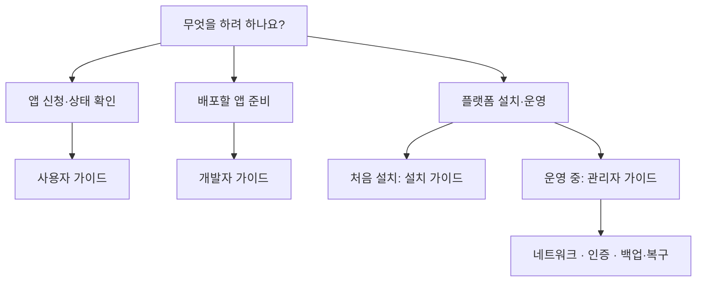

# SADP 문서

필요한 문서 하나부터 읽으십시오. 설치 명령은 [설치 가이드](installation.md), 일상 운영은
[관리자 가이드](administrator-guide.md)가 기준입니다.

## 역할별 시작

아래 그림에서 자신의 작업을 고른 뒤 표의 문서를 여십시오. 문서의 흐름도는 GitHub에서
그림으로 표시되는 Mermaid 형식이며, 세부 조건과 명령은 그림 아래 본문을 따릅니다.




| 역할 | 먼저 읽을 문서 | 이 문서에서 해결하는 일 |
| --- | --- | --- |
| 사용자 | [사용자 가이드](usage.md) | 로그인, 앱 신청, 상태 확인, 중지·재개·삭제 |
| 앱 개발자 | [개발자 가이드](developer-guide.md) | 저장소와 이미지 준비, 배포 정책, Secret 분류 |
| 플랫폼 관리자 | [관리자 가이드](administrator-guide.md) | 설치, 권한, GitOps, 장애, 백업 |
| 신규 설치 담당자 | [설치 가이드](installation.md) | 10단계 설치와 인수인계 |

## 설치 방법 두 가지

두 방법은 같은 `configure-site.py` 검증기와 같은 `render/node/cluster` 설치기를 사용합니다.

### site.env 기반

값을 미리 준비하거나 자동화할 때 사용합니다.

```bash
bash ./sadp --install --env-file /etc/sadp/site.env --phase all
```

### 질문·답변형

처음 설치하거나 변수 의미가 익숙하지 않을 때 사용합니다. Secret 값은 묻지 않고 root 전용 파일
경로만 받습니다.

```bash
sudo bash ./sadp --install-wizard
```

간편 모드에서는 RKE2와 로컬 NIC를 먼저 조회해 확인된 실제 IP·CIDR·DNS를 기본값으로 제안합니다.
조회되지 않은 기존값·예제값은 미확인으로 표시합니다. 묶음에서 Enter로 수락하거나 `n`으로 수정할 수 있습니다.
노드·NIC 역할과 공인 IP·공개 방식·인증 설정은 별도로 확인합니다.
모든 활성 항목을 직접 입력하려면 `--advanced`,
자동 조회만 생략하려면
`--no-detect`를 붙입니다. 자세한 선택 방법은 [설치 가이드](installation.md)를 따릅니다.

마법사가 만든 `/etc/sadp/site.env`도 반드시 render 계획, 생성, test, commit/push 순서를 거칩니다.
검증 오류가 나면 다른 답변을 유지한 채 해당 항목만 수정합니다. 기존 파일의 오류만 고치려면
`sudo bash ./sadp --install-wizard --repair`를 사용합니다. 저장되지 않은 이전 답변은 복원하지 않습니다.

## 설치 후 참고 문서

| 작업 | 문서 |
| --- | --- |
| 모든 `site.env` key와 생성 규칙 | [사이트 설정](site-configuration.md) |
| NIC, 방화벽, Squid, DNS | [네트워크·egress](network-egress.md) |
| wildcard staging → production | [Let's Encrypt DNS-01](letsencrypt-dns01.md) |
| 외부 OpenID/SAML 연결 | [외부 인증](identity-provider.md) |
| 외부 Grafana/Wazuh 기계 인증 | [기계 인증](external-observability.md) |
| 안전 기동·종료, SADP/RKE2 업데이트 | [운영 수명주기](operations-lifecycle.md) |
| Portal API | [Portal API](portal-api.md) · [OpenAPI](../apps/portal-lite/backend/openapi.yaml) |
| 백업과 복원 | [복구](recovery.md) |
| 보안 보장·비보장과 앱 사고 격리 | [보안 경계](security-boundaries.md) |
| Forgejo token 회전 | [token 회전](runbooks/forgejo-token-rotation.md) |
| 개별 명령 진단 | [스크립트 안내](../scripts/README.md) |

## 공통 안전 규칙

- 실제 IP, FQDN, 저장소 URL, 사용자명, token, password, 인증서, 개인키를 Git 문서에 쓰지 않습니다.
- `# Generated by` 파일은 직접 수정하지 않습니다. `/etc/sadp/site.env`에서 다시 생성합니다.
- Secret 본문은 Git이나 `site.env`가 아니라 root 전용 파일 또는 OpenBao에 둡니다.
- 통합 설치와 `--apply`를 지원하는 관리 명령은 먼저 계획을 확인합니다.
  `--install-squid`, `--render-network`처럼 기본 실행이 변경인 명령도 있으므로
  [스크립트 안내](../scripts/README.md)와 해당 `--help`에서 실행 경계를 확인합니다.
- node phase는 RKE2를 자동 재시작하지 않습니다.
- 문서와 명령이 다르면 `bash ./sadp --list`와 각 명령의 `--help`가 우선입니다.
