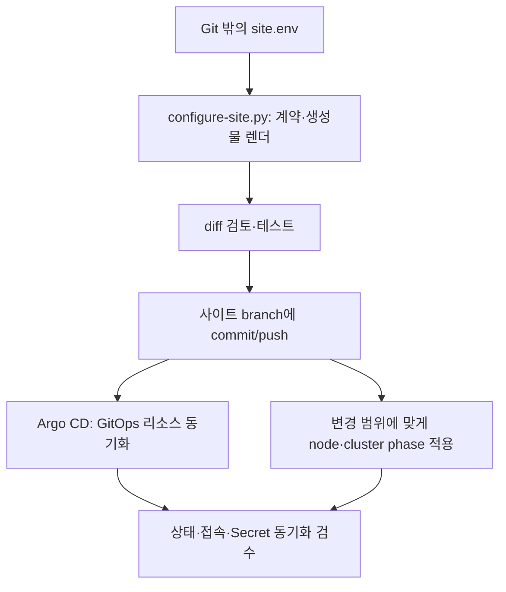

# SADP 관리자 가이드

설치된 SADP를 운영하는 관리자를 위한 안내입니다. 매일 상태를 확인하고, 앱 신청을 승인하고,
설정을 바꾸거나 장애에서 복구할 때 참고하세요. 처음 설치한다면 [설치 가이드](installation.md)를
먼저 따릅니다. 운영체제와 RKE2 신규 설치는 별도로 준비해야 합니다.

이 문서의 클러스터 명령은 **control-plane의 SADP 저장소 루트**에서 실행합니다.
각 worker의 NIC·서비스를 확인하는 작업은 해당 worker에서 따로 수행합니다.
짧은 `kubectl` 명령의 실행 환경은 [설치 가이드](installation.md#실행-위치-확인)를 참고하세요.
용어가 낯설면 [기본 개념](concepts.md)을 읽으세요.

## 1. 관리 범위

| 영역 | 관리자가 책임지는 것 |
| --- | --- |
| 클러스터 | 관리 서버 1대와 worker N대(N >= 0)의 준비 상태, 저장공간, Pod 네트워크, 유지보수 |
| 네트워크 | NIC 역할, 외부 80/443 접속, 프록시(Squid), DNS, 관리 포트 차단 |
| 인증 | 조직 로그인 서버(IdP) 연결과 앱별 로그인·그룹 권한 확인 |
| Secret | 관리자 전용 입력 파일, OpenBao 보관, ESO 공급, Reloader 반영 |
| GitOps | 사이트 입력, 생성 설정, Forgejo 변경 기록, Argo CD 동기화 |
| 운영 | 설치 결과 검수, 백업·복원 시험, 토큰·인증서 교체 |

## 2. 설치

신규 사이트는 [설치 가이드](installation.md)를 처음부터 순서대로 실행합니다.

- 자동화·반복 설치: `/etc/sadp/site.env` 기반 설치
- 처음 설치: `sudo bash ./sadp --install-wizard` 질문·답변형 설치

env와 Secret 파일을 준비한 뒤 control-plane에서 먼저 전체 설치 계획을 확인합니다.

```bash
sudo bash ./sadp --install --env-file /etc/sadp/site.env --phase all
```

유지보수 시간을 확보하고 계획이 맞는지 확인한 뒤 적용합니다.

```bash
sudo bash ./sadp --install --env-file /etc/sadp/site.env --apply
```

기본 `all --apply`는 etcd snapshot, 렌더·검사·생성물 commit/push, SSH를 통한 노드 순차
재시작, TLS 전환과 서비스 설치를 자동으로 이어갑니다. 유지보수 중단과 쓰기 권한이 필요합니다.
개별 `render/node/cluster` phase로 실행하면 기존 수동 재시작 경계를 유지합니다.

## 3. 설정과 GitOps 원칙



- 운영 사이트는 사용하는 `site.env`가 설정 입력의 기준입니다. 설치기의 기본 위치는
  `/etc/sadp/site.env`이며, 다른 위치를 쓰는 사이트는 실제 파일 경로를 확인합니다.
- `# Generated by` 파일과 계약을 따로 손으로 고치지 않습니다. 입력을 수정한 뒤 다시 생성하세요.
  실제 `site.env`가 없는 개발 저장소의 예외는 [사이트 설정](site-configuration.md#1-값의-소유-위치)을 따릅니다.
- 장애 중 클러스터를 직접 수정했다면 원인 해결 뒤 `site.env`와 Git에도 같은 의도를 기록합니다.
  그렇지 않으면 다음 생성이나 Argo 동기화가 수정을 되돌릴 수 있습니다.
- 개별 node/cluster phase는 checkout이 `site.env`와 다르면 중단됩니다. all은 먼저 렌더합니다.

설정 key의 의미는 [사이트 설정](site-configuration.md)을 사용합니다.

## 4. 일상 운영

### 매일

Node는 서버 상태, Argo Application은 Git 배포 상태, Gateway·HTTPRoute는 외부 접속 상태입니다.
control-plane에서 다음과 같이 목록을 확인합니다. `Synced`뿐 아니라 의도한 Git revision도 확인하세요.

```bash
kubectl get nodes
kubectl get applications -n devtroncd
kubectl get gateway,httproute -A
kubectl get pods -A
kubectl get externalsecret -A
```

- Portal **관리자** 메뉴에서 승인 대기 신청과 보안 검사 반려를 확인합니다.
- 실패 Pod와 반복 restart를 확인합니다.
- ExternalSecret과 인증 오류를 확인하되 Secret 값은 출력하지 않습니다.

### 매주

- 인증서 만료와 DNS-01 상태를 확인합니다.
- node disk, PVC, 쿼터를 확인합니다.
- 백업 파일과 checksum을 검증합니다.
- 로그인, Forgejo, Registry, Argo 실패를 검토합니다.

### 변경할 때

`site.env`를 수정한 뒤 아래 순서로 계획, 파일 생성, 저장소 시험을 진행합니다.
이때 설정 파일을 읽을 수 있는 권한이 필요합니다.

```bash
bash ./sadp --install --env-file /etc/sadp/site.env --phase render
bash ./sadp --install --env-file /etc/sadp/site.env --phase render --apply
bash ./sadp --test
```

생성된 diff를 검토하고 사이트 branch에 commit/push한 뒤 영향 범위에 따라 node 또는 cluster 단계를
실행합니다. **파일 생성, Git 반영, 실제 적용, 상태 검수는 각각 별도 작업**입니다.
마지막에는 [검수 명령](#8-검수-명령)으로 실제 동작을 확인하세요.

## 5. 계정과 권한 운영

- 일반 사용자에게 kubeconfig, RKE2 token, OpenBao root token을 주지 않습니다.
- Portal 조회와 쓰기 권한을 분리합니다.
- Portal `/admin`과 승인 API는 외부 OIDC의 정확한 `platform-admin` 역할만 허용합니다.
- 앱 Secret 권한은 앱별 group/role로 제한합니다.
- `platform-admin`은 일상 계정과 분리하고 최소 인원만 사용합니다.
- Argo Git read, Portal Git write, Registry push, Registry pull credential을 서로 분리합니다.
- token은 [Forgejo token 회전 Runbook](runbooks/forgejo-token-rotation.md)에 따라 회전합니다.

Secret 본문은 Git, `site.env`, 명령 인자, 인수인계 문서에 넣지 않습니다.

## 6. 배포 승인 운영

기본적으로 관리자가 배포를 승인해야 합니다. Portal이 만든 배포 변경안(PR)이 보안 검사를
통과해도 승인 전에는 병합·이미지 빌드·배포가 시작되지 않습니다.
승인 기록은 PVC에 누적 저장하므로 Portal 재시작 뒤에도 복구합니다. 승인 증거가 없으면
`pr-open`, 즉 변경안이 열린 상태에서 대기합니다.

1. `platform-admin` 세션으로 Portal의 **관리자** 메뉴를 엽니다.
2. 파이프라인 상태와 승인·보안 상태를 별도로 확인합니다.
3. 보안 통과 요청만 승인합니다. 반려할 때는 신청자가 조치할 수 있는 사유를 반드시 적습니다.
4. 반려하면 Portal이 결정자·시각·수동 여부·사유를 먼저 영속화하고 열린 배포 PR을 닫습니다.
5. 실제 private GitOps PR 링크는 이 화면에서만 엽니다. 일반 사용자에게 저장소 권한이나 링크를
   전달하지 않습니다.

사용자별 자동 승인 예외는 같은 화면에서 켜거나 끕니다. 변경 관리자·시각과 이력이 PVC에 남고,
활성화 즉시 그 사용자의 기존 승인 대기 요청과 이후 요청에 적용됩니다. 이 예외도 필수 보안
검사를 건너뛰지 않습니다. 예외 계정의 업무 필요성이 끝나면 즉시
끄고 변경 이력을 검토합니다.

**승인됐어도 배포 준비가 부족하면 실패할 수 있습니다.** `OIDC_CLIENT_SECRET`이나 OpenBao/ESO policy·role이 없어도
보안 검사를 통과한 열린 PR의 수동·자동 승인 기록은 저장됩니다. 이후 병합 직전 검사에서
준비가 확인되지 않으면 승인 상태는 `approved`로 유지되고 배포 상태는 `failed`가 됩니다.
관리자는 OpenBao의 필수 key와 ESO policy/role을 확인하고 원인을 해결해야 합니다.
실패 중인 PR을 수동 병합해 검사를 우회하지 마세요. 일반 사용자에게는 배포 실패 메시지만
안내하고 Secret 값·private PR·보안 감사 상세는 공유하지 않습니다.

## 7. 장애 분류

원인을 모르면 control-plane에서 읽기 전용 진단부터 실행하세요.
출력된 `[CAUSE]`로 원인을 확인하고 `[NEXT]` 명령의 실행 위치와 적용 여부를 읽은 뒤 진행합니다.

```bash
sudo bash ./sadp --doctor --env-file /etc/sadp/site.env
```

| 증상 | 첫 확인 | 문서 |
| --- | --- | --- |
| 공개 URL 연결 실패 | NAT/direct, 공인 IP, Gateway, 80/443 | [네트워크](network-egress.md) |
| HTTPS 또는 Certificate 실패 | Issuer, Order, Challenge, wildcard Secret | [DNS-01](letsencrypt-dns01.md) |
| 로그인 반복·SAML 오류 | OIDC issuer/callback, 외부 broker와 상위 IdP | [외부 인증](identity-provider.md) |
| Worker만 image/DNS 실패 | containerd proxy, CoreDNS, Squid | [네트워크](network-egress.md) |
| `ImagePullBackOff` | immutable tag, pull credential, Registry 권한, containerd proxy/Squid redirect 차단 | Pod event와 [redirect 탐지](network-egress.md#고정-이미지의-redirect-자동-탐지) |
| ExternalSecret timeout | OpenBao sealed/active endpoint, 자동 판별된 Store Ready condition | [복구](recovery.md#7-openbao-sealexternalsecret-timeout-복구) |
| Portal 배포 API 503 | Forgejo 연결과 bot 권한 | [Portal API](portal-api.md) |
| 데이터 손상 | 추가 쓰기 중단, 마지막 검증 백업 | [복구](recovery.md) |

ExternalSecret의 raw `kubectl wait` timeout은 설치 성공이 아닙니다. OpenBao가 재기동 뒤 sealed이면
ESO provider는 HTTP 503 `Vault is sealed`를 받고 SecretStore 또는 ClusterSecretStore가 일시적으로
Ready가 아닐 수 있습니다. unseal 후에도 이전 실패 condition을 다시 reconcile하려면 force-sync가
필요할 수 있습니다.

control-plane에서만 다음 순서로 확인합니다.

```bash
sudo bash ./sadp --unseal-openbao

# sealed일 때만 실행
sudo bash ./sadp --unseal-openbao --apply

kubectl annotate externalsecret \
  -n <EXTERNAL_SECRET_NAMESPACE> <EXTERNAL_SECRET_NAME> \
  force-sync="$(date +%s)" --overwrite

kubectl wait \
  externalsecret/<EXTERNAL_SECRET_NAME> \
  -n <EXTERNAL_SECRET_NAMESPACE> \
  --for=condition=Ready --timeout=2m
```

최종 성공 조건은 ExternalSecret `Ready=True`, 참조 Store `Ready=True`, 대상 Secret 객체 존재입니다.
실패 시 ExternalSecret과 Store의 `status.conditions`만 확인합니다. Pod 로그 전체, Secret YAML,
Secret data, OpenBao token, unseal key를 출력하지 않습니다. 이 manager와 unseal 명령은 Kubernetes
API와 OpenBao Pod를 직접 다루므로 worker에서 실행하지 않습니다.

## 8. 검수 명령

control-plane 노드에서 실행합니다.

```bash
sudo bash ./sadp --verify-squid
sudo bash ./sadp --verify-portal-auth
sudo bash ./sadp --verify-testbed
```

`verify-testbed`의 host 검사는 실행한 control-plane 한 대만 확인합니다. worker의 NIC와 systemd
상태는 각 worker에서 별도로 확인합니다.

## 9. 백업과 복구

침해가 의심되는 개별 앱은 삭제부터 하지 않습니다. 정확한 대상과 계획을 확인한 뒤 Argo
reconcile, 외부 Route, 실행 Pod를 함께 격리해 PVC·Secret·감사 기록을 보존합니다.

```bash
sudo bash ./sadp --quarantine-app \
  --app <APP_NAME> --namespace <APP_NAMESPACE>
sudo bash ./sadp --quarantine-app \
  --app <APP_NAME> --namespace <APP_NAMESPACE> --apply
```

복구 전제와 자격증명 회전·중지 revision·검증된 재개 순서는
[보안 경계의 침해 대응 절차](security-boundaries.md#침해-의심-앱-격리와-복구)를 따릅니다.

기본 백업은 클러스터 설정을 담은 RKE2 etcd와 Secret을 담은 OpenBao Raft를 보관합니다.
**앱 PVC의 실제 데이터와 외부 IdP는 이 백업에 포함되지 않습니다.** 앱 데이터는 앱별 백업 정책을,
외부 IdP는 해당 운영팀의 백업 정책을 확인하세요.

```bash
sudo bash ./sadp --backup
sudo bash ./sadp --verify-backups
```

복원은 장애 중 쓰기를 멈추고 [복구 Runbook](recovery.md)을 따릅니다. 백업 성공 로그만 믿지 않고
checksum과 실제 복원 시험 일시를 기록합니다.

## 10. 안전 기동·종료와 업데이트

전체 테스트베드를 끌 때는 전체 백업과 worker drain을 먼저 완료하고 모든 worker, server 순서(single은 server만)로
RKE2를 중지합니다. 켤 때는 server를 먼저 Ready로 만든 뒤 worker를 시작하고 마지막에 uncordon합니다.

```bash
sudo bash ./sadp --power prepare-off --role server
bash ./sadp --update-sadp
sudo bash ./sadp --upgrade-rke2 --role server
```

SADP 업데이트는 GitHub main의 루트 `VERSION`이 더 높을 때만 fast-forward하며, 패키지 목표와 RKE2
목표는 `versions.lock.yaml`을 사용합니다. RKE2 업그레이드는 전체 전원 종료와 달리 server를 먼저
업데이트한 뒤 worker를 한 대씩 처리합니다. 정확한 순서와 복구 경계는
[기동·종료·업데이트 Runbook](operations-lifecycle.md)을 따릅니다.

## 11. 인수인계 체크리스트

- [ ] site/cluster 이름과 배포 Git revision
- [ ] Portal과 관리 서비스 주소
- [ ] `/etc/sadp/site.env`와 root 전용 Secret 파일의 위치·소유자
- [ ] 운영 담당자와 장애 연락 경로
- [ ] token·인증서 회전 일정
- [ ] 마지막 백업과 복원 시험 일시
- [ ] 마지막 acceptance 결과

사용자에게는 [사용자 가이드](usage.md), 앱 작성자에게는
[개발자 가이드](developer-guide.md)를 전달합니다.
