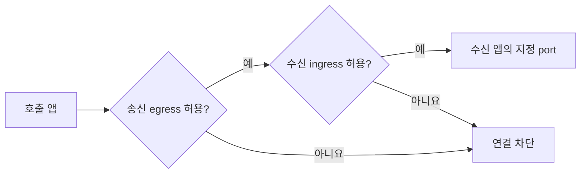

# SADP 개발자 가이드

이 문서는 SADP에 올릴 앱을 준비하는 개발자를 위한 안내입니다. 플랫폼 설치와 클러스터 장애는
[관리자 가이드](administrator-guide.md), 화면 사용법은 [사용자 가이드](usage.md)를 따릅니다.

## 1. 배포 방식 선택

| 방식 | 알맞은 경우 | 이미지 |
| --- | --- | --- |
| 단일 앱 | 저장소와 Dockerfile로 앱 하나를 build | Portal build 또는 기존 image |
| AppGroup | Compose로 여러 기존 서비스를 묶음 | 고정 tag/digest의 prebuilt image |

## 2. 단일 앱 저장소 준비

- Git URL은 credential, query, fragment가 없는 HTTPS 주소를 사용합니다.
- Dockerfile 경로는 저장소 루트 기준 상대경로입니다.
- 앱은 `0.0.0.0:<PORT>`에서 수신해야 합니다.
- 설정은 환경변수로 받고, 이미지 안에 password나 인증서를 넣지 않습니다.
- `latest`, `main`, `stable` 같은 가변 image tag를 운영에 사용하지 않습니다.
- 종료 신호를 처리하고 재시작 후에도 정상 기동하도록 만듭니다.

## 3. 정책 입력

### 공개와 인증

| 노출 | 인증 | 결과 |
| --- | --- | --- |
| external | none | 공개 HTTPS 앱 |
| external | oidc | 외부 OIDC 로그인이 필요한 HTTPS 앱 |
| internal | none | 클러스터 내부 앱 |

internal 앱에 OIDC를 요청할 수 없습니다. 앱이 직접 NodePort, Ingress, LoadBalancer를 만들지 않고
플랫폼의 Envoy Gateway 경로를 사용합니다.

OIDC 통과는 앱 진입 허용일 뿐입니다. 앱의 조회·수정·삭제 API는 요청자와 대상 객체의 관계를
서버에서 매번 검사해야 합니다. 목록, 검색, 다운로드, WebSocket, 캐시 key도 같은 사용자 범위를
적용합니다. NetworkPolicy는 앱이 읽은 자료를 정상 응답에 담는 권한 오류를 막지 않습니다.

### 외부 통신

| 모드 | 의미 |
| --- | --- |
| 차단 | DNS와 명시된 내부 연결만 허용 |
| web | 인터넷 TCP 80/443 허용, 내부망 제외 |
| custom | 지정 CIDR·port·protocol만 추가 |

`web`은 도메인 허용 목록이 아닙니다. 특정 도메인만 허용해야 하면 현재 NetworkPolicy만으로는
구현할 수 없으므로 관리자와 별도 egress 방식을 설계합니다.

## 4. 자원과 port

- container port에는 애플리케이션이 실제로 듣는 TCP port를 입력합니다.
- 자원은 임의 수치가 아니라 Portal preset을 선택합니다.
- 쿼터는 preset × replica로 계산됩니다.
- stateful 데이터는 앱 이미지가 아니라 승인된 volume에 저장합니다.

## 5. 일반 설정과 Secret

| 값 | 예 | 경로 |
| --- | --- | --- |
| 일반 설정 | 로그 레벨, 기능 flag, 공개 endpoint | ConfigMap/GitOps values |
| Secret | password, token, API key, 개인키 | OpenBao → ESO → Secret |

Git에는 Secret 이름, OpenBao path, key 이름만 둡니다. 실제 값, `.env`, dockerconfig, kubeconfig를
commit하지 않습니다.

## 6. 앱 간 통신



그림은 NetworkPolicy의 허용 조건입니다. 실제 연결에는 Service와 앱도 정상이어야 합니다.


default-deny가 기본입니다. 호출 앱의 egress와 수신 앱의 ingress 양쪽이 모두 허용돼야 합니다.
서비스 이름과 port를 문서화하고, 필요하지 않은 CIDR 전체 허용을 요청하지 않습니다.

## 7. AppGroup 입력과 제한

- 같은 Forgejo의 Git URL 또는 Compose 원문을 사용합니다.
- Compose `build:`, privileged, host network, host path는 지원하지 않습니다.
- image는 고정 tag 또는 digest가 필요합니다.
- port가 없는 service는 worker로 배포되며 외부 Route가 없습니다.
- named volume은 플랫폼 고정 StorageClass·크기, RWO, replica 1을 사용합니다.
- 그룹 이름은 플랫폼 전체에서 유일하며 기본 Namespace는 `app-<group>`입니다.
- Secret은 관리자가 준비한 OpenBao key 이름만 입력합니다.

## 8. 배포 전 체크리스트

- [ ] credential 없는 HTTPS Git URL을 사용한다.
- [ ] Dockerfile과 build context가 저장소 안에 있다.
- [ ] 앱이 입력한 port에서 수신한다.
- [ ] immutable image tag 또는 digest를 사용한다.
- [ ] 일반 설정과 Secret을 분리했다.
- [ ] 필요한 ingress/egress만 요청했다.
- [ ] 모든 조회·변경·다운로드에 사용자별 객체 인가 시험이 있다.
- [ ] 로그·오류 응답·캐시에 다른 사용자의 데이터가 섞이지 않는다.
- [ ] 재시작과 종료 신호를 로컬에서 시험했다.

## 9. 배포 결과 확인

Portal의 **내 앱**에서 신청 ID, PR, pipeline 상태를 확인합니다. 앱이 `RUNNING`인데 오류가 있으면
앱 로그에 Secret 값을 출력하지 않았는지 먼저 확인하고, 앱 이름·commit·발생 시각을 관리자에게
전달합니다.

API 자동화가 필요하면 [Portal API](portal-api.md)와
[OpenAPI](../apps/portal-lite/backend/openapi.yaml)를 사용합니다.

## 10. 저장소 개발 검증

플랫폼 chart나 스크립트를 함께 수정했다면 저장소 루트에서 실행합니다.

```bash
bash ./sadp --test
```

Portal UI까지 수정했다면 UI 디렉터리의 `AGENTS.md`와 package script를 따릅니다. 실제 cluster
적용은 관리자 승인과 [설치 가이드](installation.md)의 render → test → commit/push 경계를
통과해야 합니다.

## Portal 프론트엔드 로컬 개발

저장소 루트에서 다음 명령으로 샘플 API와 Next 개발 서버를 함께 실행합니다.
UI `package.json`의 Node 버전을 사용하고, 처음에는 의존성을 설치합니다.

```bash
npm --prefix apps/portal-lite/ui ci
npm --prefix apps/portal-lite/ui run dev:mock
```

브라우저 주소는 Next가 출력하는 `Local` 주소를 사용합니다. UI 포트를 지정하려면
`npm --prefix apps/portal-lite/ui run dev:mock -- --port 3001`로 실행합니다.
기본 바인딩은 loopback이며 로그인은 개발용 샘플 세션으로 우회합니다.
API 포트 8081이 이미 사용 중이면 기존 서버에 연결하지 않고 실행을 중단합니다.

목 API는 카탈로그·쿼터·샘플 앱 목록과 상세 조회, 단일 앱 생성·삭제·시작·정지,
Compose/AppGroup 미리보기와 생성 응답을 제공합니다. Compose는 간단한 서비스 이름
추출만 흉내 내며 저장소 조회, 실제 빌드·배포, OpenBao, 관리자 승인 API는 구현하지 않습니다.
AppGroup 생성 응답은 성공 화면 확인용이며 서비스별 요청을 저장하지 않습니다.
실제 API의 정책·인증·멱등성 검증은 별도로 수행해야 합니다.

데이터는 메모리에만 남고 재시작하면 초기화됩니다. `Ctrl+C`로 API와 Next를 함께 종료합니다.
기존 `npm run dev`는 실제 백엔드를 사용하는 개발 명령으로 유지됩니다.
