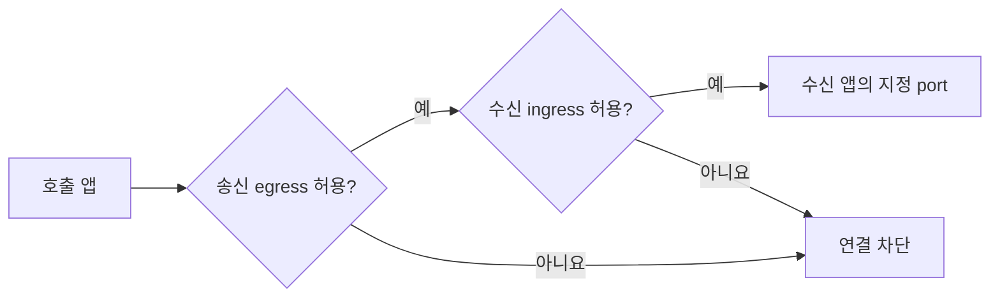

# SADP 개발자 가이드

내 프로그램을 SADP에서 실행할 수 있도록 준비하는 방법을 안내합니다.
먼저 배포 방식을 고르고, 소스·이미지·실행 포트·설정을 준비한 다음 Portal에서 신청하세요.
플랫폼 설치와 클러스터 장애는 [관리자 가이드](administrator-guide.md), 화면 사용법은
[사용자 가이드](usage.md)를 따릅니다. 용어는 [기본 개념](concepts.md)에서 확인할 수 있습니다.

## 1. 배포 방식 선택

| 방식 | 알맞은 경우 | 이미지 |
| --- | --- | --- |
| 단일 앱 | 웹 앱 하나를 배포 | 소스 저장소와 Dockerfile로 빌드하거나, 미리 만든 이미지 사용 |
| AppGroup | 웹 서버·작업 서비스 등 여러 서비스를 Compose로 함께 배포 | 내용이 바뀌지 않는 tag/digest의 기존 이미지 사용 |

Dockerfile은 이미지를 만드는 방법을 적은 파일이고, Compose는 여러 서비스의 실행 구성을 적은
파일입니다. AppGroup에서는 Compose `build:`로 이미지를 만들 수 없으므로 먼저 이미지를 준비하세요.

## 2. 단일 앱 저장소 준비

- Git 주소는 사용자명·비밀번호·토큰, query(`?` 뒤 내용), fragment(`#` 뒤 내용)가 없는 HTTPS 주소를 사용합니다.
- Dockerfile 경로는 저장소 최상위 폴더 기준입니다. 루트에 있으면 `Dockerfile`, 하위 폴더에 있으면
  `<APP_DIRECTORY>/Dockerfile`처럼 입력합니다.
- 앱은 `0.0.0.0:<PORT>`에서 연결을 받아야 합니다. `127.0.0.1`에만 바인딩하면 컨테이너 밖에서
  접근할 수 없습니다. `<PORT>`는 프로그램이 실제로 듣는 포트로 바꾸세요.
- 설정은 환경변수로 받고, 이미지 안에 비밀번호나 인증서를 넣지 않습니다.
- `latest`, `main`, `stable` 같은 가변 image tag를 운영에 사용하지 않습니다.
- 종료 신호를 처리하고 재시작 후에도 정상 기동하도록 만듭니다.

## 3. 정책 입력

### 공개와 인증

| 노출 | 인증 | 결과 |
| --- | --- | --- |
| `external` | `none` | 외부에서 로그인 없이 접속하는 HTTPS 앱 |
| `external` | `oidc` | 외부에서 조직 로그인 뒤 접속하는 HTTPS 앱 |
| `internal` | `none` | 외부 주소 없이 클러스터 안에서 사용하는 앱 |

internal 앱에 OIDC를 요청할 수 없습니다. 앱이 직접 NodePort, Ingress, LoadBalancer를 만들지 않고
플랫폼의 Envoy Gateway 경로를 사용합니다.

OIDC는 앱에 들어올 수 있는 사람을 확인합니다. 로그인한 사용자가 **다른 사람의 자료를 조회하거나
수정해도 되는지**는 앱 서버가 요청마다 따로 검사해야 합니다. 목록, 검색, 다운로드, WebSocket,
캐시 key에도 같은 사용자 범위를 적용하세요. NetworkPolicy는 이런 데이터 권한 오류를 막지 않습니다.

### 외부 통신

| 모드 | 의미 |
| --- | --- |
| 차단(`blocked`) | DNS와 명시한 내부 앱 연결만 허용 |
| `web` | 내부망을 제외한 인터넷 TCP 80/443 연결 허용 |
| `custom` | 지정한 IP 대역(CIDR)·포트·통신 규격만 추가 허용 |

`web`은 도메인 허용 목록이 아닙니다. 특정 도메인만 허용해야 하면 현재 NetworkPolicy만으로는
구현할 수 없으므로 관리자와 별도 egress 방식을 설계합니다.

## 4. 자원과 port

container port는 프로그램이 실제로 듣는 TCP 포트입니다. 브라우저가 접속하는 외부 HTTPS 포트와
구분하세요. 예를 들어 프로그램이 컨테이너 안에서 8080으로 실행되면 입력값도 8080입니다.

CPU·메모리는 Portal에서 제공하는 preset을 선택합니다. 쿼터는 preset에 복제본 수를 곱해 계산하므로
복제본을 늘리면 예약하는 자원도 늘어납니다. 중지해도 예약 쿼터는 유지됩니다.
재시작 뒤에도 필요한 데이터는 이미지나 컨테이너 임시 폴더 대신 승인된 영속 저장공간에 저장하세요.

## 5. 일반 설정과 Secret

| 값 | 예 | 경로 |
| --- | --- | --- |
| 일반 설정 | 로그 수준, 기능 켜기/끄기, 공개 접속 주소 | ConfigMap과 GitOps 설정(values) |
| Secret | 비밀번호, 토큰, API 키, 개인키 | OpenBao에 보관 → ESO가 동기화 → Kubernetes Secret |

Git에는 Secret 이름, OpenBao path, key 이름만 둡니다. 실제 값, `.env`, dockerconfig, kubeconfig를
commit하지 않습니다.

## 6. 앱 간 통신



그림은 NetworkPolicy의 허용 조건입니다. 실제 연결에는 Service와 앱도 정상이어야 합니다.


기본은 연결 차단(default-deny)입니다. 예를 들어 웹 앱이 내부 API를 호출하려면 웹 앱의 송신
규칙(egress)과 API 앱의 수신 규칙(ingress)을 모두 허용해야 합니다. 같은 AppGroup 안에 있다고
자동으로 연결되지는 않습니다. 필요한 서비스 이름과 포트를 정리해 요청하세요.

## 7. AppGroup 입력과 제한

- 같은 Forgejo의 Git URL 또는 Compose 원문을 사용합니다.
- Compose `build:`, privileged, host network, host path는 지원하지 않습니다.
- image는 고정 tag 또는 digest가 필요합니다.
- port가 없는 service는 백그라운드 작업용 worker 서비스로 배포되며 외부 접속 경로가 없습니다.
  여기서 worker는 서버 역할을 뜻하는 worker 노드와 다릅니다.
- named volume은 플랫폼이 정한 저장 방식(StorageClass)과 크기를 사용합니다.
  한 노드에서 읽고 쓰는 RWO 방식이고 replica는 1입니다. 앱 삭제 때 PVC 데이터도 삭제됩니다.
- 그룹 이름은 플랫폼 전체에서 유일하며 기본 Namespace는 `app-<group>`입니다.
- Secret은 관리자가 준비한 OpenBao key 이름만 입력합니다.

## 8. 배포 전 체크리스트

- [ ] credential 없는 HTTPS Git URL을 사용한다.
- [ ] Dockerfile과 build context가 저장소 안에 있다.
- [ ] 앱이 입력한 port에서 수신한다.
- [ ] immutable image tag 또는 digest를 사용한다.
- [ ] 일반 설정과 Secret을 분리했다.
- [ ] 필요한 ingress/egress만 요청했다.
- [ ] 모든 조회·변경·다운로드에 사용자별 객체 인가 시험이 있다.
- [ ] 로그·오류 응답·캐시에 다른 사용자의 데이터가 섞이지 않는다.
- [ ] 재시작과 종료 신호를 로컬에서 시험했다.

## 9. 배포 결과 확인

Portal의 **내 앱**에서 신청 ID와 진행 단계, 승인·보안 검사 결과를 확인합니다.
일반 사용자는 비공개 GitOps PR에 접근하지 않아도 됩니다. `RUNNING`이 되면 앱 주소에서
주요 기능과 사용자별 데이터 권한도 확인하세요. 오류가 있으면 앱 이름·소스 commit·발생 시각을
관리자에게 전달하고, 로그를 공유할 때 Secret 값이 포함되지 않았는지 확인합니다.

API 자동화가 필요하면 [Portal API](portal-api.md)와
[OpenAPI](../apps/portal-lite/backend/openapi.yaml)를 사용합니다.

## 10. 저장소 개발 검증

SADP 자체의 Chart나 스크립트도 수정했다면 관리 워크스테이션의 저장소 루트에서 실행합니다.
이 시험은 클러스터 없이 돌아가며, 앱을 배포하거나 실제 서비스의 정상 동작을 확인하는 명령은 아닙니다.

```bash
bash ./sadp --test
```

Portal UI까지 수정했다면 UI 디렉터리의 `AGENTS.md`와 package script를 따릅니다. 실제 cluster
적용은 관리자 승인과 [설치 가이드](installation.md)의 render → test → commit/push 경계를
통과해야 합니다.

## Portal 프론트엔드 로컬 개발

저장소 루트에서 다음 명령으로 샘플 API와 Next 개발 서버를 함께 실행합니다.
UI `package.json`의 Node 버전을 사용하고, 처음에는 의존성을 설치합니다.

```bash
npm --prefix apps/portal-lite/ui ci
npm --prefix apps/portal-lite/ui run dev:mock
```

브라우저 주소는 Next가 출력하는 `Local` 주소를 사용합니다. UI 포트를 지정하려면
`npm --prefix apps/portal-lite/ui run dev:mock -- --port 3001`로 실행합니다.
기본 바인딩은 loopback이며 로그인은 개발용 샘플 세션으로 우회합니다.
API 포트 8081이 이미 사용 중이면 기존 서버에 연결하지 않고 실행을 중단합니다.

목 API는 카탈로그·쿼터·샘플 앱 목록과 상세 조회, 단일 앱 생성·삭제·시작·정지,
Compose/AppGroup 미리보기와 생성 응답을 제공합니다. Compose는 간단한 서비스 이름
추출만 흉내 내며 저장소 조회, 실제 빌드·배포, OpenBao, 관리자 승인 API는 구현하지 않습니다.
AppGroup 생성 응답은 성공 화면 확인용이며 서비스별 요청을 저장하지 않습니다.
실제 API의 정책·인증·멱등성 검증은 별도로 수행해야 합니다.

데이터는 메모리에만 남고 재시작하면 초기화됩니다. `Ctrl+C`로 API와 Next를 함께 종료합니다.
기존 `npm run dev`는 실제 백엔드를 사용하는 개발 명령으로 유지됩니다.
