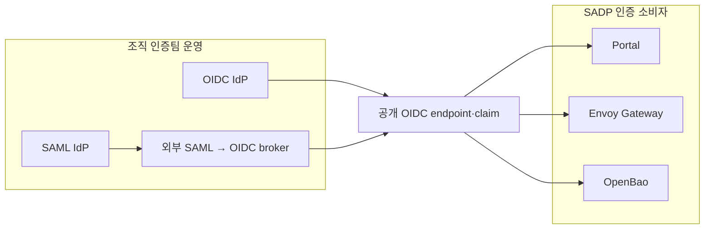

# 외부 OpenID Connect · SAML 연결

> 문서 경로: [문서 홈](README.md) → [관리자 가이드](administrator-guide.md) → 외부 인증
> 대상: 조직 IdP와 SADP를 연결하는 플랫폼·인증 관리자

SADP는 인증 서버를 설치하거나 realm, tenant, client, 사용자, 그룹을 자동 생성하지 않습니다.
계약에는 SADP가 소비할 공개 OIDC endpoint와 claim 이름만 둡니다. IdP 설정과 계정 수명주기는
조직의 인증 관리자가 소유합니다.

SADP 런타임의 인증 소비자는 OIDC를 사용합니다. 상위 인증원이 SAML만 제공한다면 조직이 운영하는
broker에서 SAML을 받아 OIDC로 내보내고, SADP에는 그 broker의 OIDC endpoint를 연결합니다.



## 1. 외부 IdP에서 준비할 항목

OIDC discovery가 제공하는 `issuer`, authorization endpoint, token endpoint, JWKS URI를 확인합니다.
모든 endpoint는 credential이 없는 HTTPS URL이어야 합니다. SADP가 사용하는 최소 scope는
`openid email profile`이며, 권한 판정에 사용할 배열형 그룹 claim도 하나 정합니다.

IdP 관리자가 confidential client를 직접 만들고 다음 redirect URI를 정확히 등록합니다.

| 소비자 | client ID | redirect URI |
| --- | --- | --- |
| Portal | 계약의 `PORTAL_OIDC_CLIENT_ID` | `https://<PORTAL_HOST>/api/auth/callback/oidc` |
| secure-demo | `secure-demo-<APP_ENVIRONMENT>` | `https://<SECURE_DEMO_HOST>/oauth2/callback` |
| OpenBao | `openbao` | `https://<OPENBAO_HOST>/ui/vault/auth/oidc/oidc/callback` |
| OpenBao CLI | 위와 같음 | `http://localhost:8250/oidc/callback` |

로그아웃 endpoint를 제공하지 않는 IdP라면 `OIDC_END_SESSION_ENDPOINT`를 비워 둡니다. 이 경우
Portal은 로컬 세션만 종료합니다.

## 2. `site.env`에 공개 계약 기록

OpenID IdP를 직접 쓰는 경우:

```bash
IDENTITY_SOURCE_PROTOCOL=openid
OIDC_ISSUER=https://<IDP_HOST>/<ISSUER_PATH>
OIDC_AUTHORIZATION_ENDPOINT=https://<IDP_HOST>/<AUTHORIZATION_PATH>
OIDC_TOKEN_ENDPOINT=https://<IDP_HOST>/<TOKEN_PATH>
OIDC_JWKS_URI=https://<IDP_HOST>/<JWKS_PATH>
OIDC_END_SESSION_ENDPOINT=https://<IDP_HOST>/<LOGOUT_PATH>
OIDC_GROUPS_CLAIM=groups
OIDC_CLIENT_ID_CLAIM=azp
PORTAL_OIDC_CLIENT_ID=<PORTAL_CLIENT_ID>
```

SAML→OIDC broker를 쓰는 경우에는 같은 OIDC 값을 적되 출처를 기록합니다.

```bash
IDENTITY_SOURCE_PROTOCOL=saml
```

SAML metadata, Entity ID, 인증서, signing key, IdP 관리자 token은 SADP 계약에 넣지 않습니다.
broker의 upstream SAML 설정은 broker 관리자가 해당 제품의 절차로 구성합니다.

## 3. client secret 전달

IdP에서 발급한 secret은 Git이나 `site.env`에 쓰지 않고 control-plane의 root 전용 파일로 전달합니다.

```bash
sudo install -d -m 0700 /var/lib/sadp/credentials
sudo install -o root -g root -m 0600 <PORTAL_SECRET_FILE> \
  /var/lib/sadp/credentials/oidc-portal-client-secret
sudo install -o root -g root -m 0600 <SECURE_DEMO_SECRET_FILE> \
  /var/lib/sadp/credentials/oidc-secure-demo-client-secret
sudo install -o root -g root -m 0600 <OPENBAO_SECRET_FILE> \
  /var/lib/sadp/credentials/oidc-openbao-client-secret
```

cluster bootstrap은 이 값을 OpenBao→ESO 경로에 넣고 SADP 소비자 설정만 수렴합니다. 외부 IdP API는
호출하지 않습니다.

## 4. 검증

```bash
python3 scripts/site/configure-site.py --env-file /etc/sadp/site.env --check
sudo bash ./sadp --verify-portal-auth
```

검증기는 discovery와 계약 endpoint가 같은지, Portal이 `oidc` provider와
Authorization Code + PKCE/state/nonce 요청을 만드는지만 읽기 전용으로 확인합니다. 실제 사용자 로그인,
MFA, 그룹 claim, SAML assertion은 외부 IdP의 승인된 테스트 계정으로 브라우저에서 확인합니다.

## 5. 기존 내장 인증 제거 시 주의

이 변경은 저장소에서 관리 매니페스트와 구성 스크립트를 제거하지만 이미 실행 중인 인증 서버나 DB를
자동 삭제하지 않습니다. 먼저 외부 OIDC 로그인과 권한을 확인한 뒤, 기존 워크로드·데이터·DNS를 별도
변경 절차와 백업 정책에 따라 폐기합니다. SADP 설치기를 삭제 도구로 사용하지 않습니다.
