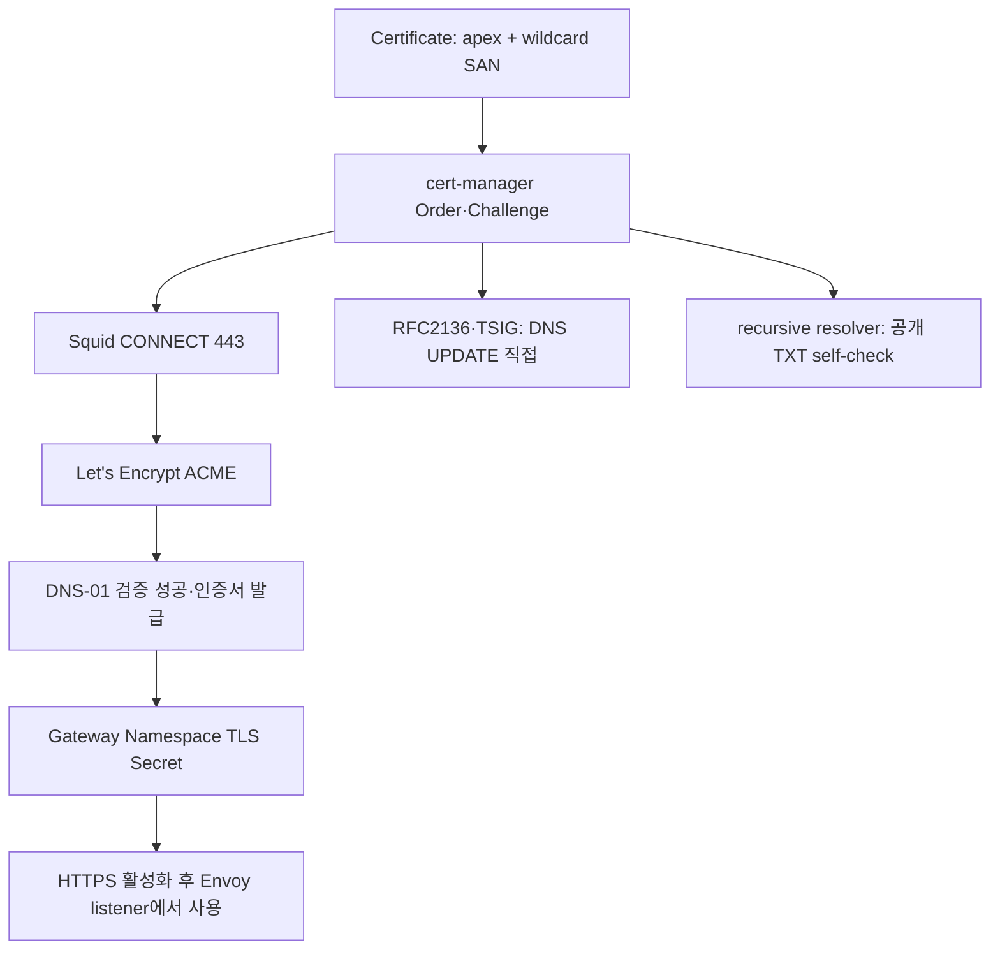

# Let's Encrypt DNS-01 wildcard 발급

> 대상: SADP wildcard 인증서를 발급·전환·복구하는 DNS/플랫폼 관리자
> 입력 기준: `environments/site.env.example`의 TLS/DNS-01 절

현재 SADP template은 `TLS_SOURCE=acme`, RFC2136, staging부터 시작합니다. 예제 domain/IP/TSIG
metadata를 실제 사이트 값으로 바꾸지 않은 상태에서는 통합 installer가 적용을 거부합니다.

## 1. 발급 구조



화살표는 발급에 필요한 통신과 결과의 흐름입니다. staging 발급 성공만으로 HTTPS를 활성화하지
않으며, production 인증서 Ready까지 확인한 뒤 전환합니다.

wildcard는 apex를 포함하지 않으므로 Certificate는 두 SAN을 모두 요청합니다. cert-manager
controller에만 proxy가 들어가고 webhook/cainjector에는 들어가지 않습니다. raw DNS UPDATE는
HTTP가 아니므로 Squid로 보낼 수 없습니다.

## 2. DNS 운영 방식 선택

SADP는 cert-manager 기본 RFC2136 solver를 사용합니다.

| DNS 운영자가 제공할 수 있는 것 | mode |
| --- | --- |
| base domain authoritative DNS의 RFC2136 endpoint와 제한된 TSIG | `direct-rfc2136` |
| `_acme-challenge` CNAME/NS 위임 | `delegated-rfc2136` |
| 둘 다 불가 | 현재 자동 wildcard 발급 미지원 |

HTTP-01은 wildcard 대안이 아닙니다. DNS 제품별 webhook/API solver를 쓰려면 renderer, egress
정책, 테스트를 별도로 확장해야 합니다.

### direct-rfc2136

```dotenv
TLS_SOURCE=acme
TLS_ISSUER_MODE=staging
ACME_STAGING_VERIFIED=false
EXISTING_GATEWAY_TLS_READY=false
DNS_PROVIDER=rfc2136
DNS01_MODE=direct-rfc2136
ACME_DELEGATION_TYPE=
ACME_DELEGATED_ZONE=
RFC2136_NAMESERVER=<AUTHORITATIVE_DNS_IPV4>:<PORT>
RFC2136_TSIG_KEY_NAME=<TSIG_KEY_NAME>
RFC2136_TSIG_ALGORITHM=HMACSHA256
DNS_CREDENTIAL_SECRET_NAME=<KUBERNETES_SECRET_NAME>
DNS_CREDENTIAL_SECRET_KEY=<SECRET_KEY>
DNS_RECURSIVE_NAMESERVERS=<PUBLIC_TXT를_볼_수_있는_IPV4>:53
```

TSIG은 `_acme-challenge` TXT에 필요한 최소 update 권한만 줍니다. cert-manager Pod가 endpoint에
직접 닿아야 합니다. control-plane만 해당 DNS에 도달할 수 있으면 다음을 설정합니다.

```dotenv
CERT_MANAGER_NODE_PLACEMENT=control-plane
```

renderer는 controller만 해당 node에 고정합니다.

### delegated-rfc2136

DNS 운영자는 원래 zone에 CNAME 또는 NS 위임만 만들고, 운영자가 관리하는 ACME 전용 DNS에
RFC2136과 자체 TSIG을 구성합니다.

```dotenv
DNS01_MODE=delegated-rfc2136
ACME_DELEGATION_TYPE=cname
ACME_DELEGATED_ZONE=<ACME_DELEGATED_ZONE>
RFC2136_NAMESERVER=<ACME_DNS_IPV4>:53
RFC2136_TSIG_KEY_NAME=<ACME_TSIG_KEY_NAME>
```

| 위임 | public DNS record | delegated zone 제약 |
| --- | --- | --- |
| `cname` | `_acme-challenge.<BASE_DOMAIN>` → delegated name | base domain과 달라야 함 |
| `ns` | `_acme-challenge.<BASE_DOMAIN>` NS 위임 | 정확히 `_acme-challenge.<BASE_DOMAIN>` |

CNAME mode는 renderer가 `cnameStrategy: Follow`, NS mode는 `None`을 사용합니다. direct로 되돌릴
때 delegation 값을 남기면 validator가 거부합니다.

## 3. TSIG Secret

TSIG shared secret은 site.env, Git, 명령 인자에 넣지 않습니다. 통합 설치기 입력은 root-only
파일 경로입니다.

```dotenv
SADP_DNS_TSIG_SECRET_FILE=/etc/sadp/secrets/<RFC2136_TSIG_FILE>
```

```bash
sudo chown root:root /etc/sadp/secrets/<RFC2136_TSIG_FILE>
sudo chmod 0600 /etc/sadp/secrets/<RFC2136_TSIG_FILE>
```

cluster apply는 파일이 일반 파일, root 소유, `0400` 또는 `0600`, non-empty인지 확인하고
`DNS_CREDENTIAL_SECRET_NAME`/`DNS_CREDENTIAL_SECRET_KEY`로 적용합니다. 값은 출력하지 않습니다.
OpenBao/ESO가 준비된 뒤에도 같은 Kubernetes Secret 이름/key의 소유권을 명확히 정하고 중복
writer가 생기지 않게 합니다.

## 4. 1단계 — staging

초기 값:

```dotenv
TLS_ISSUER_MODE=staging
ACME_STAGING_VERIFIED=false
EXISTING_GATEWAY_TLS_READY=false
```

생성·검사·Git 반영:

```bash
python3 scripts/site/configure-site.py \
  --env-file /etc/sadp/site.env --write
bash ./sadp --test
# diff 검토 후 사이트 branch에 commit/push
```

control-plane 적용:

```bash
sudo bash ./sadp --install \
  --env-file /etc/sadp/site.env --phase cluster --apply
```

이 단계는 `<WILDCARD_TLS_SECRET>-staging` Certificate/Secret을 만들고 Gateway는 HTTP listener를
유지합니다. 통합 installer는 기반 플랫폼까지만 진행하고 서비스 bootstrap·앱 배포를 정상적으로
보류합니다.

```bash
kubectl get clusterissuer
kubectl -n <GATEWAY_NAMESPACE> get certificate,certificaterequest,order,challenge
kubectl -n <GATEWAY_NAMESPACE> wait \
  certificate/<WILDCARD_TLS_SECRET>-staging \
  --for=condition=Ready --timeout=15m
kubectl -n cert-manager logs deployment/cert-manager --tail=200
```

staging Certificate `Ready=True`와 SAN 두 개를 확인한 뒤에만 다음 단계로 갑니다.

## 5. 2단계 — production 발급

site.env를 다음처럼 바꿉니다.

```dotenv
ACME_STAGING_VERIFIED=true
TLS_ISSUER_MODE=production
EXISTING_GATEWAY_TLS_READY=false
```

다시 configure → test → commit/push → cluster apply를 실행합니다. production Certificate가 운영
Gateway Secret을 만들지만 아직 Route를 HTTPS listener로 옮기지 않습니다.

```bash
kubectl -n <GATEWAY_NAMESPACE> wait \
  certificate/<WILDCARD_TLS_SECRET> \
  --for=condition=Ready --timeout=15m
```

Secret을 삭제해 전환하지 않습니다. staging과 production Secret은 분리되고 Envoy는 Secret
갱신을 감지합니다.

## 6. 3단계 — HTTPS 활성화

production Certificate `Ready=True`, apex/wildcard SAN, 유효기간을 확인한 뒤:

```dotenv
EXISTING_GATEWAY_TLS_READY=true
```

세 번째로 configure → test → commit/push → cluster apply를 실행합니다. 이때 생성 계약이 HTTPS
listener와 HTTP→HTTPS redirect를 활성화하고 통합 installer가 bootstrap·기본 앱·검수까지
이어갑니다.

```bash
sudo bash ./sadp --verify-d5
sudo bash ./sadp --verify-testbed
```

외부 DNS에는 apex와 wildcard A record가 모두 필요합니다. NAT 환경은 내부 client용 hairpin 또는
split DNS도 확인합니다.

## 7. self-check와 egress 진단

지정 resolver는 public authoritative TXT 변경을 볼 수 있어야 합니다.

```bash
dig @<RECURSIVE_DNS_IPV4> TXT _acme-challenge.<BASE_DOMAIN>
dig @<AUTHORITATIVE_DNS_IPV4> TXT _acme-challenge.<BASE_DOMAIN>
```

`--dns01-recursive-nameservers-only`를 사용하므로 fallback이 없습니다. split DNS가 빈
`_acme-challenge`를 권위 응답하거나 resolver가 public zone에 닿지 못하면 `SERVFAIL`로 실패합니다.
일반 CoreDNS upstream인 `CLUSTER_UPSTREAM_DNS`와 혼동하지 않습니다.

raw DNS 경로는 target node에서 확인합니다. TSIG secret을 process list에 노출하는 진단 명령은
공유 runbook에 기록하지 않습니다. DNS 관리자는 자신의 승인 도구로 SOA, update 권한, key 이름과
algorithm을 검증합니다.

## 8. 대표 오류

### ACME directory `Forbidden`

ClusterIssuer에 ACME GET `Forbidden`이 보이면 Let's Encrypt 자체보다 Squid ACL을 먼저 확인합니다.

```bash
kubectl get nodes \
  -o custom-columns=NAME:.metadata.name,POD_CIDR:.spec.podCIDR
kubectl -n cert-manager get pods -o wide
sudo grep 'TCP_DENIED' /var/log/squid/access.log | tail
```

실제 Pod CIDR이 `POD_CIDRS`와 `SQUID_CLIENT_CIDRS`에 포함돼야 합니다. 값은 생성물이 아니라
site.env에서 고치고 render 후 Squid를 재설치합니다.

### SOA `REFUSED`

```bash
dig @<RFC2136_NAMESERVER_IPV4> SOA <BASE_DOMAIN> +norecurse
dig @<RFC2136_NAMESERVER_IPV4> SOA _acme-challenge.<BASE_DOMAIN> +norecurse
```

`REFUSED`는 proxy 문제가 아니라 solver가 물은 zone을 그 DNS가 권위 관리하지 않거나 mode/zone이
실제 위임과 다르다는 뜻입니다.

| mode | 확인 |
| --- | --- |
| direct | server가 base domain 권위, delegation 값 비움 |
| delegated+CNAME | public CNAME과 delegated zone 일치 |
| delegated+NS | `_acme-challenge` NS 위임과 전용 zone SOA 권위 응답 |

### 오래된 Challenge

solver 수정 후 새 Certificate가 `Ready=True`인지 먼저 확인합니다. 삭제 중인 옛 Challenge의
finalizer를 제거하는 것은 owner Order가 사라졌고 DNS 운영자가 잔여 TXT가 없음을 확인한 단일
리소스에만 마지막 수단으로 사용합니다. Namespace 전체나 광범위 label 삭제는 하지 않습니다.

## 9. 운영 유지 조건

- production/staging ACME domain의 Squid 허용을 유지합니다.
- RFC2136 endpoint/port와 최소권한 TSIG을 유지·회전합니다.
- Certificate Ready, 만료/renewal 시각, Order/Challenge 실패, Squid deny를 감시합니다.
- 클러스터가 앞서 진행됐으면 site.env의 세 TLS 진행값도 즉시 같은 상태로 올립니다.
- IP 주소 SAN 인증서는 DNS-01 wildcard와 별도 문제이며 같은 Certificate/Secret으로 처리하지 않습니다.
