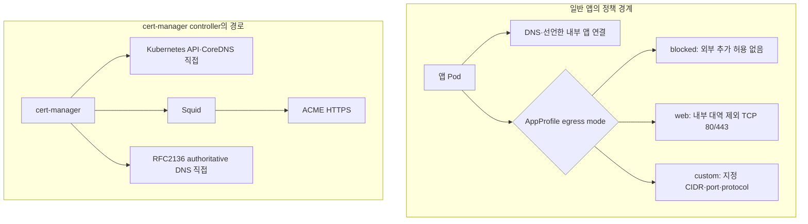

# SADP 네트워크·egress 운영 안내

> 대상: 다중 NIC, Squid, CoreDNS, cert-manager 경로를 운영하는 관리자
> 입력 기준: `site.env` → 계약 → `render-network.py`

SADP는 RKE2 Canal(Flannel VXLAN + Calico NetworkPolicy)을 사용합니다. Worker의 일반 인터넷
직접 egress는 열지 않고 승인된 HTTP(S)는 Squid로 보냅니다.

## 1. 통신 경계



앱 영역은 NetworkPolicy가 허용하는 범위이며 실제 인터넷 경로의 연결 성공까지 보장하지 않습니다.

기본 Kubernetes NetworkPolicy는 FQDN allowlist를 제공하지 않으므로 앱의 `web` mode는 내부
대역을 제외한 TCP 80/443 포트 정책입니다.

NetworkPolicy는 허용된 연결의 응답 트래픽도 허용합니다. 앱이 정상 요청의 응답에 자신이 읽은
자료를 담는 유출, 사용자별 인가 오류, 외부 통신 없는 변조·삭제는 egress 정책의 보장 범위가
아닙니다. 일반 외부 앱에는 브라우저의 외부 fetch/subresource/form을 줄이는 응답 보안 헤더도
강제하지만 응답 본문과 redirect 자체를 검사하지는 않습니다. 전체 경계와 사고 격리는
[보안 보장과 한계](security-boundaries.md)를 따릅니다.

## 2. 설정과 생성

사이트별 값은 `/etc/sadp/site.env`에서 고칩니다. 생성된 `platform/network/*`,
`platform/dns/*`, `rke/*`는 직접 편집하지 않습니다.

필수 확인:

- 기존 RKE2 Pod/Service CIDR과 cluster DNS
- 전체 노드의 내부 IPv4와 공통 internal/external NIC 이름
- Kubernetes API 주소와 RKE2 server endpoint
- Squid 내부 IPv4/port와 node/Pod client CIDR
- CoreDNS upstream 내부 `<IPv4>:<port>`
- Gateway VIP/pool, public IP, NAT/direct mode
- RFC2136 update endpoint와 DNS-01 recursive resolver

```bash
ip -br link
ip -br -4 address
ip -4 route

python3 scripts/site/configure-site.py \
  --env-file /etc/sadp/site.env --check
python3 scripts/site/configure-site.py \
  --env-file /etc/sadp/site.env --write
bash ./sadp --test
```

생성 diff를 commit/push하고 각 노드에서 통합 installer의 node phase를 사용합니다.

## 3. 다중 NIC와 RKE2 identity

`INTERNAL_INTERFACE` 이름은 RKE2 node IP, server bind/advertise address와 Canal
`flannel.iface`에 사용됩니다. `EXTERNAL_INTERFACE`와 guarded NIC에는 Kubernetes
관리 port 차단이 적용됩니다.

이름이 실제 식별자이며 MAC으로 대체할 수 없습니다. MAC은 노드마다 다르므로 site.env에 넣지
않고, 개별 스크립트를 진단할 때 `--internal-mac`, `--external-mac`으로 이름과 실제
NIC의 일치만 단언합니다. 노드별 이름이 다르면 `systemd.link`로 먼저 통일합니다.

통합 적용:

```bash
sudo bash ./sadp --install \
  --env-file /etc/sadp/site.env --phase node
sudo bash ./sadp --install \
  --env-file /etc/sadp/site.env --phase node --apply
```

node phase가 자동 역할 판별 후 수행하는 일:

- 해당 노드가 담당하면 Squid를 가장 먼저 설치·검증
- 계약 소유 RKE2 config field 병합
- 내부 NIC/IP identity와 Canal interface 고정
- external/guarded NIC 관리 port guard 설치
- embedded containerd proxy 설정
- control-plane이면 monitoring pull용 Docker daemon proxy 설정
- 해당 노드가 담당하면 DNS forwarder 설치

`SQUID_INTERNAL_IP`를 가진 노드의 node phase를 먼저 적용하고 `--install-squid --check`와
`--verify-squid`를 통과시킨 뒤 다른 노드와 cluster phase로 진행합니다. cluster phase는
Devtron/Helm chart 작업 전에 Squid를 다시 확인하고 Prometheus/Loki/Alloy 이미지를 이 경로로
모든 노드에 선배포합니다.

Docker daemon은 셸의 `HTTP_PROXY`만으로 바뀌지 않습니다. 개별 control-plane node phase 적용 후
`systemctl restart docker`를 사람이 실행하고 다음 검사를 통과시킵니다.

```bash
sudo bash ./sadp --install-docker-proxy --check
```

개별 노드 설치기는 RKE2를 자동 재시작하지 않습니다. worker를 한 대씩 drain → `rke2-agent` restart →
Ready → uncordon하고 마지막에 승인된 창에서 server를 재시작합니다.
통합 `--install --apply`는 이 순서와 Docker 재시작을 자동으로 수행합니다.

### 개별 identity 진단

```bash
sudo bash ./sadp --install-network-identity \
  --role server \
  --internal-ip <CONTROL_PLANE_INTERNAL_IPV4> \
  --internal-interface <INTERNAL_NIC> \
  --external-interface <EXTERNAL_NIC>

sudo bash ./sadp --install-network-identity \
  --role server \
  --internal-ip <CONTROL_PLANE_INTERNAL_IPV4> \
  --internal-interface <INTERNAL_NIC> \
  --external-interface <EXTERNAL_NIC> \
  --apply
```

agent에는 `--server-url https://<RKE2_SERVER_INTERNAL_IPV4>:9345`를 추가합니다. 개별 스크립트도
재시작하지 않습니다.

## 4. interface guard

external/guarded NIC에서 API 6443, supervisor 9345, etcd 2379/2380, kubelet 10250 등 계약의
관리 TCP port를 IPv4/IPv6 모두 차단합니다. internal NIC은 guard 대상이 될 수 없습니다.

```bash
sudo bash ./sadp --install-interface-guard \
  --external-interface <EXTERNAL_NIC> \
  --blocked-tcp-ports 2379,2380,6443,9345,10250

sudo bash ./sadp --install-interface-guard \
  --external-interface <EXTERNAL_NIC> \
  --blocked-tcp-ports 2379,2380,3128,6443,9345,10250 \
  --apply
```

guard unit은 fail-open입니다. unit 실패가 RKE2 시작을 막지 않으므로 다음을 모니터링하고 외부
방화벽에서도 관리 port를 차단합니다.

```bash
systemctl status sadp-rke2-interface-guard.service
sudo iptables -S SADP_RKE2_GUARD
sudo ip6tables -S SADP_RKE2_GUARD
```

SSH/DB와 애플리케이션 port는 이 guard가 대신 통제하지 않습니다.

## 5. Squid

`spec.network.squid.internalIP`를 가진 노드에만 통합 node apply가 설치합니다. 직접 설치기는
`--apply` 2단계가 아니라 기본 실행이 설치이고 `--check`가 현재 상태 검사입니다.

```bash
sudo -E bash ./sadp --install-squid
sudo bash ./sadp --install-squid --check
bash ./sadp --verify-squid
```

최초 package 설치에는 승인된 upstream proxy나 내부 apt mirror가 필요합니다. Worker direct
인터넷을 임시로 열지 않습니다.

생성된 Squid는 승인된 ACME/chart/package/IdP domain만 허용하고 `ssl_bump`와 cache는 사용하지
않습니다. 장애 진단은 요청이 실제 Squid에 도착했는지부터 확인합니다.

```bash
grep ' <CLIENT_IPV4> ' /var/log/squid/access.log | tail
curl --fail --proxy 'http://<SQUID_INTERNAL_IPV4>:<SQUID_PORT>' \
  'https://<APPROVED_HOST>/'
```

로그가 없으면 ACL보다 client proxy 설정/DNS/route 문제입니다. `TCP_DENIED`가 있을 때만
site.env의 allowlist 입력과 생성 결과를 확인합니다.

## 6. RKE2 embedded containerd proxy

각 노드의 `/etc/default/rke2-server` 또는 `rke2-agent`에 RKE2가 containerd로 전달할 관리 환경을
설치하고, 재시작 뒤 두 process에서 실제 이름을 따로 확인합니다.

- 관리 파일과 RKE2 process: `CONTAINERD_HTTP_PROXY`, `CONTAINERD_HTTPS_PROXY`, `CONTAINERD_NO_PROXY`
- RKE2가 시작한 embedded containerd: `HTTP_PROXY`, `HTTPS_PROXY`, `NO_PROXY`

기본은 실행 중 RKE2와 systemd unit으로 server/agent를 자동 판별합니다. 둘 다 있거나 아무것도
없으면 fail-close하고 그때만 `--role server|agent`로 해소합니다. plan/check/failure는 변수 이름만
출력하고 값은 출력하지 않습니다.

```bash
sudo bash ./sadp --install-containerd-proxy
sudo bash ./sadp --install-containerd-proxy --apply
```

관리 파일은 일반 파일과 mode 0600만 허용합니다. symlink, 중첩/짝 불일치 표식은 덮어쓰지 않습니다.
지원하는 적용 옵션에 `--restart`는 없습니다. 적용 뒤 관리자가 drain/유지보수 경계를 지켜
서비스를 재시작한 다음 각 노드에서 파일과 두 process 환경을 함께 검사합니다.

```bash
sudo bash ./sadp --install-containerd-proxy --check
```

신규 노드는 [설치 가이드의 node bundle SCP/checksum 절차](installation.md#4-secret-없는-node-bundle을-모든-노드에-배포)를
사용합니다. 이미 실행 중인 RKE2 cluster의 drift는 control-plane에서 모든 노드에 Ready인 기존
Canal/Calico image를 재사용해 중앙 수렴할 수 있습니다. plan은 Kubernetes 리소스를 만들지 않습니다.

```bash
sudo bash ./sadp --manage-containerd-proxy
sudo bash ./sadp --manage-containerd-proxy --apply
```

중앙 명령은 `hostNetwork`, `hostPID`, host root mount와 `privileged`를 잠깐 사용하므로 선택 image의
`sh`, `nsenter`, `cp`, `chmod`, `mkdir`, `rm`, `sleep`을 먼저 검사합니다. ServiceAccount token은
mount하지 않으며 성공·rollout 실패·signal 모두에서 ConfigMap/DaemonSet을 삭제합니다. 출력된 실제
node 이름의 명령대로 worker를 한 대씩 drain → agent restart → Ready → uncordon하고 server를
마지막에 처리합니다. 재시작은 중앙 명령이 대신 실행하지 않습니다.

```bash
sudo bash ./sadp --manage-containerd-proxy --check
sudo bash ./sadp --preflight --image-pull-only
```

`--image-pull-only`는 topology와 StorageClass를 생략하고 digest 고정 public image를
`imagePullPolicy: Always`, `hostNetwork: true`, Linux selector, 모든 taint toleration의 임시
DaemonSet으로 실제 CRI pull합니다. 성공 여부는 explicit proxy `curl`이 아니라 이 pull로 판정합니다.

Registry `/v2/`는 challenge 확인용입니다. `401`은 registry까지 도달했다는 증거일 뿐 image pull
성공이 아닙니다. `curl --fail`의 exit만 보지 말고 HTTP code를 별도로 받습니다.

```bash
code=$(curl --silent --show-error --output /dev/null \
  --write-out '%{http_code}' --proxy 'http://<SQUID_HOST>:<PORT>' \
  'https://<REGISTRY_HOST>/v2/' || true)
printf 'registry challenge HTTP=%s\n' "${code}"
```

| 증상 | 먼저 판정할 경계 | 다음 조치 |
| --- | --- | --- |
| `Downloaded` | Devtron 설치 진행 중 | 최종 `Applied`와 workload Ready를 기다림 |
| `ImagePullBackOff` + `lookup registry ... on 127.0.0.53` | containerd proxy 미적용 또는 적용 후 RKE2 미재시작 | 중앙 plan/apply → 순차 재시작 → 중앙 check → image-pull-only |
| Registry HTTP 5xx/timeout | pull 단계의 일시적 upstream 장애 | `--sync-images`의 제한 재시도 결과 확인; archive 손상으로 분류하지 않음 |
| `ctr: content digest sha256:<DIGEST>: not found` | export archive에서 manifest가 참조한 blob 누락 | 기존 tar 반복 import 금지; `sudo bash ./sadp --sync-images --image-list platform/monitoring/images.txt`로 새 pull/export/검증 |
| `/v2/`가 `401` | Registry challenge 도달만 성공 | 실제 CRI pull 결과 확인 |
| Squid `TCP_DENIED` | registry 또는 redirect/CDN allowlist 누락 | `site.env`/계약 package domain과 renderer 수정 후 재렌더 |
| `Accepted=True`, `ResolvedRefs=False: BackendNotFound` | Route/Namespace 순서는 정상, backend Service 미기동 | 해당 선택 Application/Service Ready 진단 |

Devtron 1.5.0/operator chart 0.22.92의 실제 render image 목록은
`platform/devtron/images.txt`에 고정합니다. 현재 `quay.io`, `public.ecr.aws`와 Quay blob redirect
`cdn01/02/03.quay.io`, ECR Public 레이어 redirect `d5l0dvt14r5h8.cloudfront.net`이 생성 Squid 계약에 포함됩니다.
Registry manifest 조회에 성공해도 레이어 CDN이 차단되면 Redis 등의 pull은 실패합니다.
CloudFront 전체 suffix를 허용하지 않고 확인된 다운로드 호스트만 기본 목록에 포함합니다. 생성된 `squid.conf`를 직접 고치지 않습니다.
private 앱 image에는 별도 pull Secret이 필요하며 kaniko push credential과 재사용하지 않습니다.

## 7. CoreDNS upstream

Worker가 node `/etc/resolv.conf`의 resolver에 닿지 못하면 CoreDNS가 외부 이름을 `SERVFAIL`로
반환합니다. 이때 `CLUSTER_UPSTREAM_DNS=<INTERNAL_IPV4>:53`을 설정하고 그 주소의 노드에 내부 DNS
forwarder를 설치합니다.

```bash
# 기본 실행은 설치, --check는 설치된 상태 검사
sudo bash scripts/node/install-dns-forwarder.sh
sudo bash scripts/node/install-dns-forwarder.sh --check

kubectl rollout status -n kube-system deployment/rke2-coredns-rke2-coredns
```

통합 platform 설치가 생성된 CoreDNS ConfigMap을 적용하고 rollout을 기다립니다. 이 값은 DNS-01
self-check용 `DNS_RECURSIVE_NAMESERVERS`와 다릅니다. upstream은 일반 외부 이름, recursive
nameserver는 public `_acme-challenge` 권위 응답을 보기 위한 경로입니다.

## 8. cert-manager egress

`render-network.py`가 cert-manager Application과 NetworkPolicy를 함께 생성합니다.

- proxy env는 controller에만 적용하고 webhook/cainjector에는 적용하지 않습니다.
- controller는 Squid 3128을 통해 ACME HTTPS에 접근합니다.
- RFC2136 DNS UPDATE는 계약 nameserver의 TCP/UDP port로 직접 갑니다.
- CoreDNS와 Kubernetes API는 `NO_PROXY`/직접 경로입니다.
- recursive self-check는 `--dns01-recursive-nameservers-only`를 사용합니다.

Squid와 DNS 경로를 먼저 준비하지 않으면 ACME Challenge가 실패합니다. 발급과 staging/production
전환은 [DNS-01 안내](letsencrypt-dns01.md)에서 진행합니다.

## 9. 최종 검수

control-plane에서:

```bash
sudo bash ./sadp --verify-testbed
```

이 검수의 host interface/systemd 검사는 실행한 control-plane 한 대만 봅니다. 각 worker에서는
별도로 다음을 확인합니다.

```bash
ip -br -4 address
ip -4 route
systemctl status rke2-agent
systemctl status sadp-rke2-interface-guard.service
```

최종 기대 경계:

| 경로 | 허용 | 차단 |
| --- | --- | --- |
| internal NIC | RKE2/etcd/API/kubelet/Canal, Squid | 승인되지 않은 경로 |
| external NIC | Envoy TCP 80/443 | Kubernetes 관리 port, DB, 임의 ingress |
| 앱 Pod | 선언한 DNS/internal/web/custom | 나머지 egress |

NetworkPolicy는 Pod 정책일 뿐 node 자체의 direct 인터넷 차단을 대신하지 않습니다. 경계와 host
방화벽에서 함께 검증합니다.
