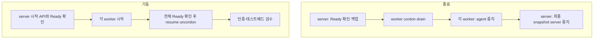

# SADP 기동·종료·업데이트 Runbook

> 대상: 1 server + N worker(N >= 0) RKE2 테스트베드의 전원 작업과 버전 업데이트를 수행하는 관리자
> 제품 버전: 저장소 루트 `VERSION`
> 구성요소 버전: `versions.lock.yaml`

이 Runbook은 전체 테스트베드 종료/기동과 버전 업그레이드를 다룹니다. 두 작업의 노드 순서는
다릅니다.

| 작업 | 순서 | 이유 |
| --- | --- | --- |
| 전체 종료 | worker N대 → server(single은 server만) | Kubernetes API와 마지막 etcd snapshot을 끝까지 유지 |
| 전체 기동 | server → worker N대(single은 server만) | API/etcd가 준비된 뒤 agent가 재가입 |
| RKE2 업그레이드 | server → worker 1대씩 | kubelet이 API server보다 앞선 minor가 되지 않게 유지 |

모든 변경 명령은 `--apply`가 없으면 계획만 출력합니다. 스크립트는 OS의 물리 전원을 직접 끄거나
원격으로 켜지 않습니다. RKE2 서비스가 안전하게 멈춘 뒤 OS 종료는 관리자가 수행하고, 기동은
BMC/가상화 플랫폼/현장 전원으로 먼저 호스트를 켠 뒤 이어갑니다.

single은 아래 worker 종료·기동·drain 단계를 생략합니다. server의 prepare-off, off, on, resume은 그대로 수행합니다.

## 1. 전체 테스트베드 안전 종료



single은 worker 단계를 건너뜁니다. OS 전원 작업은 관리자가 별도로 수행합니다.


### 1.1 control-plane에서 종료 준비

먼저 계획을 확인한 뒤 적용합니다.

```bash
sudo bash ./sadp --power prepare-off --role server
sudo bash ./sadp --power prepare-off --role server --apply
```

적용은 다음을 순서대로 수행합니다.

1. 전체 Node가 모두 Ready인지 확인
2. RKE2 etcd와 OpenBao Raft 전체 백업
3. 모든 worker cordon과 drain(single은 생략)
4. `/var/lib/sadp/power/prepared-off`에 백업 경로와 worker 목록 기록

drain은 DaemonSet을 무시하고 `emptyDir` 데이터 삭제를 승인하지만, PDB나 unmanaged Pod를 강제로
우회하지 않습니다. drain이 실패하면 원인을 해결하기 전에는 다음 단계로 진행하지 않습니다.

### 1.2 각 worker에서 agent 중지

각 worker에서 자신의 실제 짧은 hostname을 확인하고 한 대씩 실행합니다.

```bash
hostname -s
sudo bash ./sadp --power off --role agent --drained-node <WORKER_NODE_NAME>
sudo bash ./sadp --power off --role agent --drained-node <WORKER_NODE_NAME> --apply
```

모든 worker의 `rke2-agent`가 모두 멈춘 뒤 control-plane에서 Node가 cordon 상태이고 NotReady로 바뀐
것을 확인합니다. 서비스가 멈춘 worker는 이때 OS를 종료할 수 있습니다.

### 1.3 마지막으로 server 중지

control-plane에서 실행합니다.

```bash
sudo bash ./sadp --power off --role server
sudo bash ./sadp --power off --role server --apply
```

`--apply`는 종료 준비 marker와 모든 worker의 cordon/NotReady를 확인하고, 종료 직전 etcd snapshot을
`/var/lib/sadp/power/<UTC_TIMESTAMP>/`에 하나 더 만든 뒤 `rke2-server`를 중지합니다. 이 단계가
성공한 뒤 마지막으로 control-plane OS를 종료합니다.

## 2. 전체 테스트베드 안전 기동

호스트 전원을 control-plane부터 켭니다. systemd가 RKE2를 이미 자동 시작했다면 `on`은 같은 상태를
확인하는 용도로 다시 실행해도 됩니다.

### 2.1 server 시작

```bash
sudo bash ./sadp --power on --role server
sudo bash ./sadp --power on --role server --apply
```

명령은 `rke2-server`를 시작하고 Kubernetes API와 control-plane Node Ready를 기다립니다.

### 2.2 worker 시작

모든 worker의 OS를 켠 뒤 각각 실행합니다.

```bash
sudo bash ./sadp --power on --role agent
sudo bash ./sadp --power on --role agent --apply
```

### 2.3 scheduling 재개

control-plane에서 전체 Node Ready를 확인하고 worker를 uncordon합니다.

```bash
sudo bash ./sadp --power resume --role server
sudo bash ./sadp --power resume --role server --apply

sudo bash ./sadp --verify-portal-auth
sudo bash ./sadp --verify-testbed
```

`resume`은 Node 하나라도 Ready가 아니면 uncordon하지 않습니다. 성공하면 종료 준비 marker를
제거합니다. 현재 로컬 서비스 상태만 볼 때는 다음을 사용합니다.

```bash
bash ./sadp --power status --role server
bash ./sadp --power status --role agent
```

## 3. GitHub main과 VERSION 기반 SADP 업데이트

SADP 제품 버전은 루트 `VERSION`의 `x.y.z`이고, 플랫폼·delivery·RKE2 목표 버전은
`versions.lock.yaml`에 고정합니다. 공식 기본 원격은 `https://github.com/KREONET/SADP.git`의
`main`입니다.

### 3.1 업데이트 확인

```bash
bash ./sadp --update-sadp
```

이 명령은 원격 main을 임시 디렉터리에 clone하고 다음만 출력합니다.

- 로컬/원격 `VERSION`
- 원격 commit 앞 12자리
- `versions.lock.yaml`의 구성요소별 이전 → 새 버전

원격 `VERSION`이 같으면 최신으로 판정합니다. 따라서 main에 배포할 변경을 넣을 때는 반드시
`VERSION`도 함께 올려야 합니다. 원격 버전이 낮으면 downgrade로 보고 거부합니다.

### 3.2 checkout 업데이트

```bash
bash ./sadp --update-sadp --apply
```

적용은 worktree가 clean이고 현재 HEAD에서 원격 main으로 fast-forward할 수 있으며, 임시 원격
checkout에서 `bash ./sadp --test`가 전부 통과할 때만 수행됩니다. 검증 중 main commit이 바뀌어도
중단합니다. 사이트 branch가 main과 갈라졌으면 자동 merge하지 않으므로 별도 update branch에서
충돌과 생성물을 검토합니다.

원격 회귀에는 `versions.lock.yaml`에 고정된 Helm이 PATH에 있어야 합니다. Helm이 없으면 package
업데이트를 적용하지 않고 실패하며, 금지 profile의 거부 결과만 보고 통과로 오인하지 않습니다.

기존 사용자 변경이 있으면 먼저 해당 변경을 commit하거나 별도 branch로 옮깁니다. stash를 자동으로
만들거나 복원하지 않습니다.

### 3.3 사이트 계약과 패키지 적용

checkout 업데이트는 Kubernetes 리소스를 직접 바꾸지 않습니다. 실제 사이트에서는 Git 밖의
`/etc/sadp/site.env`가 상류이므로 다음 경계를 지킵니다.

```bash
# 1. 새 코드로 재렌더 계획/적용
bash ./sadp --install --env-file /etc/sadp/site.env --phase render
bash ./sadp --install --env-file /etc/sadp/site.env --phase render --apply

# 2. 생성 diff와 패키지 lock 검토
bash ./sadp --test

# 3. 승인된 사이트 GitOps branch에 commit/push 후 control-plane에서 수렴
sudo bash ./sadp --install --env-file /etc/sadp/site.env --phase cluster
sudo bash ./sadp --install --env-file /etc/sadp/site.env --phase cluster --apply
```

Argo 소유 구성요소는 승인된 GitOps commit의 Application/chart/image 버전으로 수렴합니다.
Devtron/번들 Argo CD처럼 기존 설치기의 자동 upgrade가 금지된 구성요소는 변경 목록을 확인한 뒤
별도 유지보수 승인을 받아야 합니다. updater가 이 안전 경계를 우회해 직접 Helm upgrade하지 않습니다.

## 4. RKE2 업데이트

이 저장소는 새 RKE2 클러스터를 설치하지 않습니다. 이미 설치된 노드만
`versions.lock.yaml`의 `platform.rke2`로 업데이트합니다. 목표 버전은 `vX.Y.Z+rke2rN` 형식이며
downgrade와 minor 건너뛰기를 거부합니다.

공식 RKE2 installer는 `INSTALL_RKE2_VERSION`과 `INSTALL_RKE2_TYPE`을 받아 release artifact와
공식 checksum을 확인합니다. SADP는 목표 tag의 installer를 HTTPS로 받아 실행하고 RKE2 서비스는
자동 재시작하지 않습니다. 이는 RKE2의 공식 [수동 업그레이드 안내](https://docs.rke2.io/upgrades/manual_upgrade/)
및 [installer 구현](https://github.com/rancher/rke2/blob/master/install.sh)을 따릅니다.

### 4.1 server 먼저 업데이트

control-plane에서 계획과 적용을 실행합니다. 적용 직전에 전체 SADP 백업이 자동 생성됩니다.

```bash
sudo bash ./sadp --upgrade-rke2 --role server
sudo bash ./sadp --upgrade-rke2 --role server --apply
```

installer 성공 후 유지보수 창에서 직접 재시작하고 Ready를 확인합니다.

```bash
sudo systemctl restart rke2-server
sudo systemctl is-active rke2-server
kubectl wait node/<CONTROL_PLANE_NODE_NAME> --for=condition=Ready --timeout=10m
```

server Ready와 API 기능을 확인하기 전에는 worker 업데이트를 시작하지 않습니다.

### 4.2 worker를 한 대씩 업데이트

control-plane에서 첫 worker를 drain합니다.

```bash
kubectl cordon <WORKER_NODE_NAME>
kubectl drain <WORKER_NODE_NAME> \
  --ignore-daemonsets --delete-emptydir-data --timeout=10m
```

그 worker에서 실제 hostname과 같은 `--drained-node`를 주고 실행합니다.

```bash
sudo bash ./sadp --upgrade-rke2 --role agent \
  --drained-node <WORKER_NODE_NAME>
sudo bash ./sadp --upgrade-rke2 --role agent \
  --drained-node <WORKER_NODE_NAME> --apply

sudo systemctl restart rke2-agent
```

control-plane에서 Ready와 버전을 확인한 뒤 uncordon합니다.

```bash
kubectl wait node/<WORKER_NODE_NAME> --for=condition=Ready --timeout=10m
kubectl get node <WORKER_NODE_NAME> \
  -o jsonpath='{.status.nodeInfo.kubeletVersion}{"\n"}'
kubectl uncordon <WORKER_NODE_NAME>
```

첫 worker가 정상화된 뒤 나머지 worker를 한 대씩 같은 순서로 업데이트합니다. 여러 worker를 동시에 drain하거나
재시작하지 않습니다.

### 4.3 완료 검수와 롤백 경계

```bash
kubectl get nodes -o wide
sudo bash ./sadp --verify-portal-auth
sudo bash ./sadp --verify-testbed
```

installer 적용 전에는 변경이 없으므로 그대로 중단할 수 있습니다. binary/package가 설치된 뒤에는
임의 downgrade하지 않습니다. 재시작 전 문제가 발견되면 서비스를 재시작하지 않고 원인을 조사하며,
재시작 후 문제가 생기면 [백업·복원 Runbook](recovery.md)의 검증된 snapshot과 해당 버전 호환성을
기준으로 별도 복구 승인을 받습니다.
