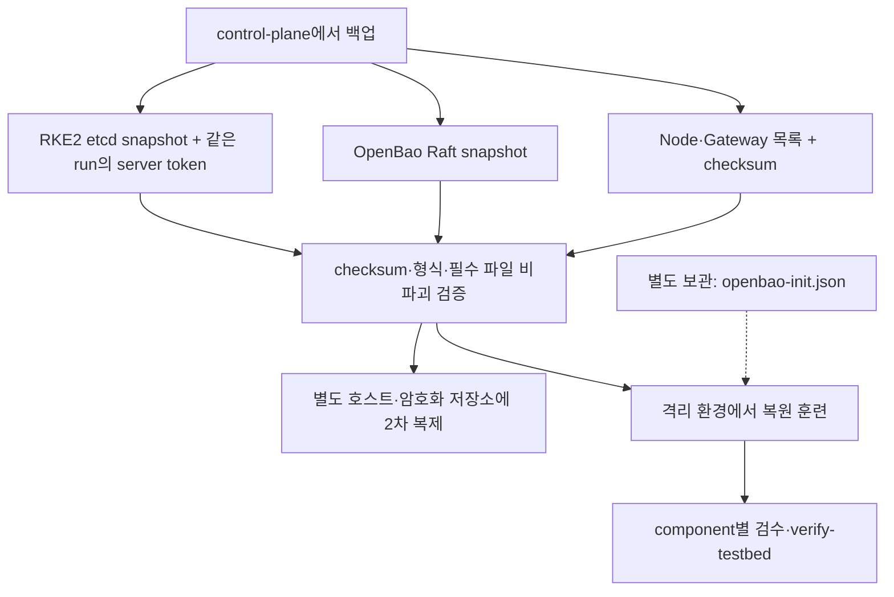

# SADP 백업·복원 안내

> 대상: 승인된 백업 검증과 RKE2/OpenBao 복원을 수행하는 관리자
> 백업 구현: `scripts/ops/backup-testbed.sh`
> 검증 구현: `scripts/verify/verify-backups.sh`

복원은 기존 상태를 덮어쓸 수 있는 별도 변경 작업입니다. 일반 장애 조사 중 바로 실행하지 않고
백업 시각, 영향 범위, 서비스 중지, 롤백 기준을 승인받습니다.

## 1. 실제 백업 산출물



백업 파일 검증과 복원 성공 검증은 별개입니다. 외부 IdP·broker와 앱 PVC 데이터의 복구를
이 백업만으로 보장하지 않습니다.


백업은 `/var/lib/sadp/backups/<UTC_TIMESTAMP>/`에 생성되고 `latest` symlink가 마지막 run을
가리킵니다.

| 파일 | 내용 |
| --- | --- |
| `sadp-etcd-*.zip` | 압축된 RKE2 etcd snapshot |
| `rke2-server-token` | 해당 snapshot과 함께 필요한 server token |
| `openbao-raft.snap` | OpenBao Raft snapshot |
| `cluster-inventory.txt` | 백업 시점 Node 목록 |
| `gateway-inventory.txt` | 백업 시점 Gateway/HTTPRoute 목록 |
| `SHA256SUMS` | 같은 디렉터리 파일 checksum |

외부 IdP와 SAML→OIDC broker의 백업·복원은 해당 인증 운영팀의 책임이며 SADP 백업에 포함되지 않습니다.

백업에는 cluster 복원 material과 인증 데이터가 포함됩니다. 디렉터리는 root-only로 유지하고
별도 호스트 또는 암호화된 객체 저장소에 2차 복제합니다. `openbao-init.json`은 snapshot에 포함되지
않으므로 승인된 별도 보안 매체에도 보관합니다.

## 2. 백업과 비파괴 검증

control-plane에서:

```bash
sudo bash ./sadp --backup
sudo bash ./sadp --verify-backups
```

특정 run 검증:

```bash
sudo bash scripts/verify/verify-backups.sh \
  /var/lib/sadp/backups/<UTC_TIMESTAMP>
```

검증은 다음을 수행합니다.

- `SHA256SUMS` 전체 확인
- etcd ZIP과 OpenBao gzip 형식 검사
- RKE2 server token 존재 확인

검증 성공은 cluster 전체 복원 성공을 대신하지 않습니다. 정기적으로 격리 환경에서 전체 복원
훈련을 수행합니다.

## 3. 복원 전 공통 절차

1. 장애 시각, 선택 백업, 담당자, 변경 승인과 중단 기준을 기록합니다.
2. 대상 디렉터리에서 checksum과 `--verify-backups`를 통과시킵니다.
3. 손상 상황이 허용하면 현재 상태의 새 안전 백업을 만듭니다.
4. 사용자 쓰기와 배포 파이프라인을 중지합니다.
5. Argo CD 자동 sync가 복원 중 리소스를 되돌리지 않도록 승인된 방식으로 일시 중지합니다.
6. snapshot, server token, `openbao-init.json`의 site/시각이 일치하는지 확인합니다.
7. 복원 후 component별 검수와 `verify-testbed`를 실행합니다.

Secret 값과 token은 작업 기록, shell trace, 화면 공유에 남기지 않습니다.

## 4. RKE2 etcd 복원

지원 topology는 server 1대와 worker N대(N >= 0)이므로 server 한 대에서 복원합니다. 선택한 snapshot과 같은
backup run의 `rke2-server-token`을 사용합니다.

```bash
sudo systemctl stop rke2-server
sudo rke2 server \
  --cluster-reset \
  --etcd-s3=false \
  --cluster-reset-restore-path=/var/lib/sadp/backups/<UTC_TIMESTAMP>/<ETCD_SNAPSHOT>.zip \
  --token-file=/var/lib/sadp/backups/<UTC_TIMESTAMP>/rke2-server-token
sudo systemctl start rke2-server
```

복원 대상의 RKE2 버전은 backup 생성 버전과 호환돼야 합니다. topology가 여러 server로 확장됐다면
이 단일 server 절차를 그대로 사용하지 말고 pinned RKE2 버전의 multi-server restore 절차에 따라
모든 server 중지, 첫 server reset, 나머지 재가입을 별도로 계획합니다.

확인:

```bash
kubectl get nodes -o wide
kubectl get pods -A
kubectl get applications -n devtroncd
```

## 5. OpenBao Raft 복원

snapshot은 같은 seal key 체계로 복원합니다. 다른 seal key에 대한 `-force`는 일반 runbook 범위가
아니며 별도 재난복구 승인이 필요합니다.

```bash
kubectl -n openbao cp \
  /var/lib/sadp/backups/<UTC_TIMESTAMP>/openbao-raft.snap \
  openbao-0:/tmp/openbao-raft.snap

sudo jq -er '.root_token' /var/lib/sadp/openbao-init.json | \
  kubectl -n openbao exec -i openbao-0 -- sh -ceu '
    IFS= read -r BAO_TOKEN
    export BAO_TOKEN BAO_ADDR="$1" BAO_CACERT=/openbao/tls/ca.crt
    exec bao operator raft snapshot restore "$2"
  ' sh 'https://openbao.openbao.svc.cluster.local:8200' '/tmp/openbao-raft.snap'
```

root token을 command argv나 `kubectl exec -- env BAO_TOKEN=...`에 넣지 않습니다. 고정 shell이 stdin으로
받고 Pod 안에서만 export합니다. 복원 후 임시 snapshot을 제거하고 승인된 unseal threshold로
unseal합니다.

검수 순서:

1. OpenBao health와 Raft peer
2. audit device
3. KV v2 mount/path
4. Kubernetes auth와 OIDC auth
5. ESO SecretStore/ExternalSecret Ready
6. 앱 rollout과 Secret 비노출

## 6. 외부 IdP 장애와 복원 경계

SADP는 외부 IdP나 SAML→OIDC broker의 데이터·설정을 백업하거나 복원하지 않습니다. 인증 장애에서는
SADP의 issuer/callback/client ID 계약과 client secret 전달 상태를 읽기 전용으로 확인하고, IdP
복구는 해당 운영팀의 runbook으로 수행합니다. 복구 후에는 discovery, Portal 로그인 시작 흐름,
승인된 테스트 계정의 실제 로그인과 그룹 claim을 다시 검증합니다.


## 7. OpenBao seal/ExternalSecret timeout 복구

다음 timeout은 설치 성공이 아니라 ExternalSecret이 `Ready=True`에 도달하지 못한 실패입니다.

```text
error: timed out waiting for the condition on externalsecrets/<EXTERNAL_SECRET_NAME>
```

OpenBao 재기동 뒤 sealed 상태가 실제 원인일 수 있습니다. 이때 ESO provider는 HTTP 503 `Vault is
sealed`를 받고 SecretStore 또는 ClusterSecretStore도 일시적으로 Ready가 아닐 수 있습니다.
OpenBao를 unseal해도 ExternalSecret이 이전 실패 condition에 머물면 force-sync가 필요합니다.

control-plane에서 plan부터 실행합니다. 첫 명령이 이미 unsealed라고 확인하면 `--apply`는 생략합니다.

```bash
sudo bash ./sadp --unseal-openbao

# sealed일 때만 실행
sudo bash ./sadp --unseal-openbao --apply

kubectl annotate externalsecret \
  -n <EXTERNAL_SECRET_NAMESPACE> <EXTERNAL_SECRET_NAME> \
  force-sync="$(date +%s)" --overwrite

kubectl wait \
  externalsecret/<EXTERNAL_SECRET_NAME> \
  -n <EXTERNAL_SECRET_NAMESPACE> \
  --for=condition=Ready --timeout=2m
```

다시 실패하면 ExternalSecret이 실제 참조하는 Store kind/name과 양쪽 condition만 확인합니다.

```bash
kubectl get externalsecret \
  -n <EXTERNAL_SECRET_NAMESPACE> <EXTERNAL_SECRET_NAME> \
  -o jsonpath='{.spec.secretStoreRef.kind}{"/"}{.spec.secretStoreRef.name}{"\n"}{.status.conditions}{"\n"}'

# 위 kind가 SecretStore일 때
kubectl get secretstore \
  -n <EXTERNAL_SECRET_NAMESPACE> <SECRET_STORE_NAME> \
  -o jsonpath='{.status.conditions}{"\n"}'

# 위 kind가 ClusterSecretStore일 때
kubectl get clustersecretstore <SECRET_STORE_NAME> \
  -o jsonpath='{.status.conditions}{"\n"}'

# 대상 Secret은 본문이 아니라 객체 존재 여부만 확인
kubectl get secret -n <EXTERNAL_SECRET_NAMESPACE> <TARGET_SECRET_NAME> -o name
```

최종 성공은 ExternalSecret `Ready=True`, Store `Ready=True`, 대상 Secret 객체 존재가 모두 확인된
상태입니다. Pod 로그 전체, Secret YAML, 환경변수 전체를 자동 수집하지 않으며 Secret data,
OpenBao token, unseal key, root token을 화면·로그·명령 인자에 남기지 않습니다.

## 8. exposure Namespace/ReferenceGrant 적용 복구

`platform/exposure/resources.yaml` 적용이 `namespaces "monitoring" not found`처럼 중단되면 같은
`kubectl apply`만 반복하거나 생성 YAML을 손으로 고치지 않습니다. manifest의
`metadata.namespace`, Namespace 문서와 `HTTPRoute backendRefs[].namespace`를 parser로 읽는 plan을
먼저 확인합니다.

```bash
sudo bash ./sadp --prepare-exposure
sudo bash ./sadp --prepare-exposure --apply
kubectl get namespace
```

이 명령은 누락 Namespace만 만들며 workload와 Secret은 만들지 않습니다. Namespace가 확인되면
원래의 정상 플랫폼 설치를 다시 실행합니다.

```bash
sudo bash ./sadp --install \
  --env-file /etc/sadp/site.env \
  --phase cluster \
  --apply
```

이후 Route의 두 조건과 backend Service를 함께 확인합니다.

```bash
kubectl get httproute -A
kubectl describe httproute -n <ROUTE_NAMESPACE> <ROUTE_NAME>
kubectl get service -n <BACKEND_NAMESPACE> <BACKEND_SERVICE>
```

`Accepted=True`, `ResolvedRefs=False: BackendNotFound`이면 Namespace 순서 문제는 해결됐고 Service가
아직 없는 상태입니다. Namespace 생성을 반복하지 말고 선택형 Prometheus/Loki Application과
Service Ready를 진단합니다. monitoring 설치가 꺼졌다면 `site.env`의
`SADP_INSTALL_MONITORING=true`로 바꾸거나 monitoring backend 입력을 제거한 뒤 render → test →
commit/push를 다시 수행합니다.

## 9. OpenBao OIDC discovery 오류 복구

대표 증상은 OpenBao의 아래 400이지만 이 문장만으로 DNS, CA, Gateway, issuer 중 무엇인지 알 수
없습니다.

```text
Error writing data to auth/oidc/config
Code: 400
error checking oidc discovery URL
```

### 1) 원인 판별

먼저 설정을 쓰지 않는 preflight를 실행합니다. 실패하면 `auth/oidc/config` API를 호출하지 않으며
응답 본문과 credential을 출력하지 않습니다.

```bash
sudo bash ./sadp --configure-openbao-oidc
```

출력 원인과 확인 범위는 다음과 같습니다.

| preflight 원인 | 확인할 완료 증거 |
| --- | --- |
| `wildcard TLS ... ready가 아님` | `site.env` 완료 기록과 실제 production Certificate Ready가 일치 |
| `wildcard Certificate ... Ready가 아님` | Certificate condition, Order/Challenge, authoritative DNS-01 route |
| `인증서 Secret ... 없음` | Certificate의 대상과 같은 Namespace/이름의 Secret 객체 존재 |
| `InvalidCertificateRef` 또는 listener 미준비 | HTTPS listener `Accepted=True`, `Programmed=True` |
| `Gateway Service에 443 포트가 없음` | owning Gateway Service의 `.spec.ports`에 443 존재 |
| `DNS 해석 실패` | OpenBao Pod에서 issuer host가 CoreDNS/split-horizon으로 해석됨 |
| `TLS 인증서/CA 검증 실패` | wildcard SAN, chain, 만료와 OpenBao Pod trust store |
| `연결 거부` / `timeout` | OpenBao Pod→외부 OIDC HTTPS endpoint |
| `issuer 불일치` | discovery JSON의 issuer와 계약 issuer가 끝 `/`까지 정확히 같음(정규화하지 않음) |
| `StatefulSet 템플릿에 oidc-preflight 컨테이너가 없음` | `platform/openbao/proxy-values.yaml`의 `extraContainers`와 Argo `openbao` Application(devtroncd)의 Synced revision |
| `OnDelete라 기존 Pod ...가 새 템플릿(oidc-preflight)으로 교체되지 않음` | Pod `controller-revision-hash`와 StatefulSet `status.updateRevision`. 아래 [OnDelete Pod 교체](#ondelete-pod-교체)를 따른다 |
| `oidc-preflight 컨테이너가 준비되지 않음(waiting.reason=...)` | `ImagePullBackOff`/`ErrImagePull`이면 출력된 `--sync-images --image` 명령으로 모든 노드에 이미지 동기화 |
| `exec 대상 oidc-preflight 컨테이너가 Pod에 없음` | 사전 진단 뒤에도 exec가 컨테이너를 못 찾음. Pod가 방금 교체됐는지와 revision을 다시 확인 |
| `kubectl exec 권한 거부` | 실행 계정의 `pods/exec` RBAC |
| `API server→kubelet exec 연결 실패` | Pod가 있는 노드의 kubelet 10250 경로와 interface guard |

자동 출력된 다음 형태의 명령만 사용합니다. Secret은 객체 이름만 확인하고 `-o yaml`, `.data`, Pod
환경변수, client Secret 파일은 출력하지 않습니다.

```bash
kubectl -n <GATEWAY_NAMESPACE> get certificate <WILDCARD_CERTIFICATE> \
  -o jsonpath='{.status.conditions}{"\n"}'
kubectl -n <GATEWAY_NAMESPACE> get secret <TLS_SECRET> -o name
kubectl -n <GATEWAY_NAMESPACE> get gateway <GATEWAY_NAME> \
  -o jsonpath='{.status.listeners}{"\n"}'
kubectl -n <GATEWAY_NAMESPACE> get svc \
  -l gateway.envoyproxy.io/owning-gateway-name=<GATEWAY_NAME> \
  -o jsonpath='{range .items[*]}{.metadata.name}{" "}{.spec.ports[*].port}{"\n"}{end}'
kubectl -n openbao get pod openbao-0 \
  -o jsonpath='{.metadata.labels.controller-revision-hash}{" "}{range .spec.containers[*]}{.name}{" "}{end}{"\n"}'
kubectl -n openbao get statefulset openbao \
  -o jsonpath='{.spec.updateStrategy.type}{" "}{.status.updateRevision}{"\n"}'
kubectl -n openbao exec openbao-0 -- sh -c \
  'nslookup "$1" >/dev/null' sh '<OIDC_ISSUER_HOST>'
kubectl -n openbao exec openbao-0 -c oidc-preflight -- sh -c \
  'curl -q --connect-timeout 5 --max-time 15 --silent --show-error --output /dev/null "$1"' sh \
  '<OIDC_ISSUER_WITHOUT_TRAILING_SLASH>/.well-known/openid-configuration'
```

discovery URL만 issuer 끝 `/`를 떼고 만듭니다. `auth/oidc/config`의 `oidc_discovery_url`과 비교
대상 issuer는 끝 `/`를 포함한 원래 값 그대로입니다.

#### OnDelete Pod 교체

OpenBao StatefulSet은 `updateStrategy=OnDelete`입니다. unseal 재료가 필요한 Pod를 controller가 임의로
재시작하지 않게 하려는 선택이라, 템플릿에 `oidc-preflight`가 추가돼도 기존 Pod는 옛 revision으로
계속 돕니다. preflight와 `--verify-testbed`는 이를 알리기만 하고 Pod를 지우지 않습니다.

유지보수 창에서 Pod를 한 대씩 교체합니다. PVC와 Raft 데이터는 Pod 삭제로 지워지지 않습니다.

```bash
sudo /var/lib/rancher/rke2/bin/kubectl --kubeconfig /etc/rancher/rke2/rke2.yaml \
  -n openbao delete pod openbao-0
sudo bash ./sadp --unseal-openbao
sudo bash ./sadp --unseal-openbao --apply
sudo bash ./sadp --configure-openbao-oidc
```

새 Pod는 sealed로 뜨므로 unseal 전에는 ExternalSecret 공급이 멈춥니다. replica가 여러 대면 한 대의
unseal과 active/Ready를 확인한 뒤 다음 Pod로 넘어갑니다.

### 2) DNS-01 node route 복구

Certificate/Secret이 준비되지 않았다면 일반 인터넷 DNS 질의로 성공 판정하지 않습니다. 실제
cert-manager controller node의 authoritative DNS TCP/UDP 경로를 다시 검사합니다.

```bash
sudo bash ./sadp --preflight-dns01
sudo bash ./sadp --preflight-dns01 --apply
```

`no-route`, `timeout`, `refused`를 node별로 구분합니다. 특정 node만 이 경로를 쓸 수 있으면 생성된
Deployment를 patch하지 말고 `/etc/sadp/site.env`에서 아래 완료 전 설정을 고친 뒤 render → 전체
test → commit/push → cluster를 반복합니다.

```dotenv
CERT_MANAGER_NODE_PLACEMENT=control-plane
```

renderer가 cert-manager controller 전용 `nodeSelector`와 control-plane taint `toleration`을 만들며,
webhook/cainjector는 불필요하게 고정하지 않습니다. route 복구 뒤 Certificate Ready와 대상 Secret
존재를 확인하기 전에는 `EXISTING_GATEWAY_TLS_READY=true`로 올리지 않습니다.

### 3) OIDC 단계만 복구

Certificate, Secret, Gateway listener, Service 443가 모두 준비된 뒤 OIDC 단계만 적용합니다. 전체
설치를 처음부터 반복할 필요가 없습니다.

```bash
sudo bash ./sadp --configure-openbao-oidc
sudo bash ./sadp --configure-openbao-oidc --apply
```

HTTP 200이어도 JSON parse 또는 issuer 정확 일치가 실패하면 설정하지 않습니다. 기존 정상 설정은
client Secret을 읽거나 출력하지 않고 공개 필드 일치만 확인한 뒤 root-only 파일의 Secret을 stdin
JSON으로 다시 적용하므로 반복 실행해 같은 상태로 수렴합니다.

### 4) 최종 확인

성공 기준은 다음 순서입니다.

1. `--preflight-dns01 --apply` 성공
2. production wildcard Certificate `Ready=True`와 TLS Secret 객체 존재
3. Gateway HTTPS listener `Accepted=True`, `Programmed=True`, Service 443 존재
4. `--configure-openbao-oidc`에서 HTTPS 200/JSON/issuer 정확 일치
5. `--configure-openbao-oidc --apply`에서 공개 설정과 `user` role 검증 성공
6. 유지보수 창의 OpenBao UI 실제 외부 OIDC 로그인 또는 승인된 로그인 acceptance 성공

## 10. 전체 복원 후 검수

```bash
kubectl get nodes -o wide
kubectl get applications -n devtroncd
kubectl get gateway,httproute -A
kubectl get certificate -A
kubectl get externalsecret,secretstore,clustersecretstore -A

sudo bash ./sadp --verify-portal-auth
sudo bash ./sadp --verify-testbed
```

사용자 트래픽과 Argo 자동 sync는 다음이 모두 확인된 뒤 재개합니다.

- 전체 Node Ready와 핵심 Application 수렴
- Gateway/TLS와 public/OIDC/internal 접근 경계
- OpenBao/ESO Secret 동기화
- 외부 OIDC login과 group/role mapping
- Portal 신청 조회와 새 테스트 신청
- 백업 이후 Git commit과 cluster 상태 차이 검토

복원 중 만든 임시 dump/snapshot/token 복사본을 제거하고, 복원 결과와 다음 백업 시각을 기록합니다.
