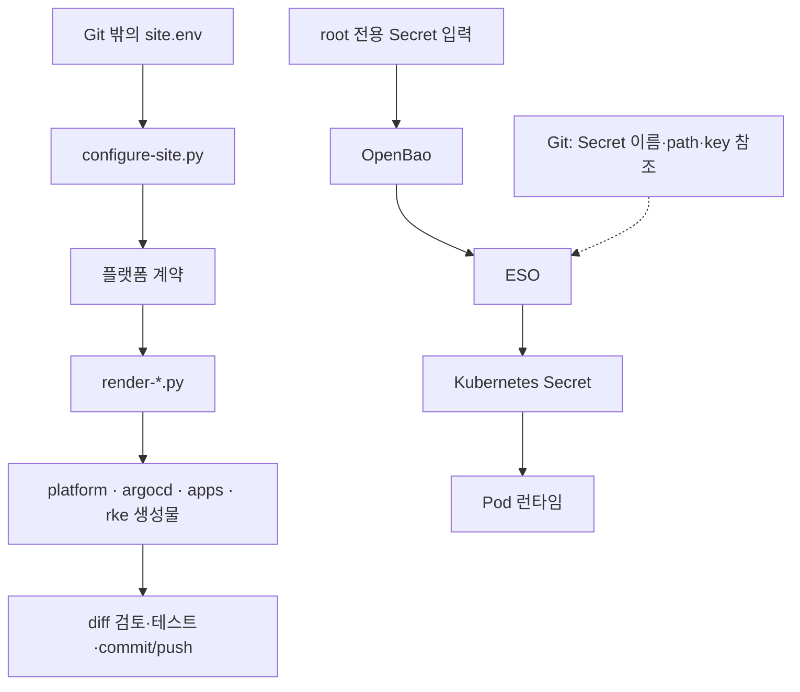

# SADP 사이트 설정 참조

> 대상: `/etc/sadp/site.env`와 계약·생성물을 관리하는 플랫폼 관리자
> 전체 key template: [environments/site.env.example](../environments/site.env.example)

`site.env`에 적을 값과 설정 변경 절차를 설명합니다. `site.env`는 사이트 주소·노드·네트워크 등
설치 입력을 모아 둔 파일이고, **계약**은 이 입력으로 만들어지는 플랫폼 설정의 기준 파일입니다.
생성된 YAML을 일일이 바꾸면 파일끼리 달라질 수 있으므로 입력을 고치고 다시 생성합니다.

처음 준비한다면 [파일 준비](#2-파일-준비) → [필수 입력](#3-필수-입력-묶음) →
[검증·생성](#4-검증생성드리프트-확인) 순서로 읽으세요. 운영 중 인증서를 전환한다면
아래 [상태 기록 값](#상태-기록-값은-설정이-아니다)을 먼저 확인합니다.
선택 기능은 해당 기능이 필요한 사이트에서만 읽으면 됩니다.

## 상태 기록 값은 설정이 아니다

ACME 발급을 쓰는 사이트에서는 아래 값을 **실제 발급 단계에 맞춰** 바꿔야 합니다.
`ACME_STAGING_VERIFIED`와 `EXISTING_GATEWAY_TLS_READY`는 확인한 완료 사실이며,
`TLS_ISSUER_MODE`는 staging 확인 뒤 운영 발급으로 전환하는 값입니다.
발급을 확인하기 전에 완료 기록을 `true`로 올리거나 `TLS_ISSUER_MODE`를 `production`으로 바꾸지 마세요.
아직 없는 인증서를 사용하려다 실패할 수 있습니다.
반대로 실제 HTTPS 전환 뒤 파일이 옛 값으로 남으면 다음 생성이 접속 경로를 HTTP로 되돌릴 수 있습니다.

| key | 언제 올리나 | 확인 명령 | 뒤처지면 | 앞서가면 |
| --- | --- | --- | --- | --- |
| `ACME_STAGING_VERIFIED=true` | staging wildcard Certificate `Ready=True`를 확인한 뒤 | `kubectl -n <GATEWAY_NAMESPACE> get certificate` | production 전환이 거부됨 | 검증 안 된 DNS-01 경로로 production 발급 시도(rate limit 위험) |
| `TLS_ISSUER_MODE=production` | 위 값을 올린 뒤 production 발급을 시작할 때 | `sudo bash ./sadp --verify-d5` | `--write`가 issuer를 staging으로 되돌림 | staging 확인 없이 발급 |
| `EXISTING_GATEWAY_TLS_READY=true` | production wildcard Secret이 Ready가 된 뒤 | `sudo bash ./sadp --verify-d5` | `--write`가 routeListener를 http로 되돌려 앱 route가 HTTP로 내려감 | Gateway가 없는 Secret을 참조(`InvalidCertificateRef`) |

통합 설치기(`--phase all --apply`)는 확인 후 이 값을 직접 갱신합니다. 단계를 손으로 진행했다면 같은
순서로 site.env를 고친 뒤 render → `--test` → commit/push → cluster를 다시 실행합니다.

## 1. 값의 소유 위치

사이트 설정과 Secret 실제 값은 서로 다른 경로로 전달됩니다.



`site.env`가 없는 개발 checkout에서 계약을 직접 관리하는 경우는 아래 설명을 따릅니다.


| 종류 | 소유 위치 |
| --- | --- |
| 사이트별 비밀 아닌 입력 | `/etc/sadp/site.env` |
| 플랫폼 계약과 생성 리소스 | Git, `configure-site.py --write` 결과 |
| Secret 이름/path/property | Git 계약과 values |
| Secret 실제 값 | OpenBao 또는 root-only bootstrap 파일 |
| Pod Secret | ESO가 만든 Kubernetes Secret |

`configure-site.py`는 env를 shell로 source하지 않고 직접 파싱합니다. 알 수 없는 key, 중복 key,
shell expansion, credential처럼 보이는 key/value, placeholder가 남은 적용을 거부합니다.

설정을 바꾸기 전에 다음 두 위치에 파일이 있는지 확인하세요.
없는 파일은 `No such file or directory`로 표시되며, 이 확인만으로 설정은 바뀌지 않습니다.

```bash
sudo ls -l environments/site.env /etc/sadp/site.env
```

- 하나만 있으면 해당 파일이 이 사이트에서 쓰는 입력인지 확인하고 `--env-file`에 명시합니다.
- 둘 다 있으면 운영 담당자에게 어느 파일을 사용하는지 확인합니다. 도구가 자동으로 고르지 않습니다.
- 둘 다 없고 별도로 지정한 입력도 없는 개발 저장소라면 계약을 직접 관리할 수 있습니다.
  계약 변경 후 `render-*.py`로 하위 파일을 다시 만들고 시험·가드를 확인합니다.

운영 `site.env`가 있으면 그것이 입력의 기준(상류)입니다. 계약과 생성물을 손으로 고쳐도 다음
`--write`에서 되돌아가므로 사이트 입력과 생성 결과를 함께 맞춰야 합니다.

## 2. 파일 준비

**새 사이트에서 파일을 처음 만들 때만** 아래 복사 명령을 실행합니다.
기존 `/etc/sadp/site.env`가 있으면 백업과 변경 검토 후 편집하세요. 예제를 다시 복사하면 기존 설정을 덮어씁니다.

```bash
sudo install -d -m 0700 /etc/sadp /etc/sadp/secrets
sudo install -m 0600 environments/site.env.example /etc/sadp/site.env
sudoedit /etc/sadp/site.env
```

통합 설치기의 기본 위치는 `/etc/sadp/site.env`입니다. 개발 checkout에는 `environments/site.env`를 둘
수도 있으나 도구는 두 곳을 자동 탐색하지 않으므로 모든 명령에 `--env-file`을 명시합니다.

`site.env.example`의 key를 삭제하거나 복제하지 말고 값을 사이트 사실에 맞게 바꿉니다. 특히
다음 문서 전용 값은 적용 전에 모두 없어야 합니다.

- `*.example.invalid`
- `192.0.2.0/24`, `198.51.100.0/24`, `203.0.113.0/24`
- 예제 노드 이름, NIC, Gateway VIP/pool, Forgejo/Registry endpoint

Secret 본문은 env에 넣지 않습니다. 통합 설치기의 다음 변수에는 root 소유 `0400`/`0600` 일반
파일의 절대경로만 기록합니다.

```dotenv
SADP_ARGO_REPO_TOKEN_FILE=/etc/sadp/secrets/<FORGEJO_READ_TOKEN_FILE>
SADP_DNS_TSIG_SECRET_FILE=/etc/sadp/secrets/<RFC2136_TSIG_FILE>
SADP_REGISTRY_PULL_DOCKERCONFIG=/etc/sadp/secrets/<PULL_DOCKERCONFIG_FILE>
SADP_REGISTRY_PUSH_DOCKERCONFIG=/etc/sadp/secrets/<PUSH_DOCKERCONFIG_FILE>
SADP_GIT_PUSH_TOKEN_FILE=/etc/sadp/secrets/<FORGEJO_WRITE_TOKEN_FILE>
SADP_PORTAL_FORGEJO_TOKEN_FILE=/etc/sadp/secrets/<PORTAL_BOT_TOKEN_FILE>
```

pull은 이미지를 내려받는 권한, push는 이미지를 올리는 권한입니다. 두 Docker config의 파일과
권한을 분리합니다. `_FILE`이나 `_DOCKERCONFIG` 변수에는 비밀값 자체가 아닌 파일 경로를 적으세요.

## 3. 필수 입력 묶음

아래 정보는 서버 조회 결과나 사이트 담당자가 확정한 값으로 채웁니다.
모르는 IP·CIDR·인증 주소를 예제에서 가져와 그대로 사용하지 마세요.
정확한 key와 형식은 [입력 예제](../environments/site.env.example)가 기준입니다.

| 영역 | 확인할 사실 |
| --- | --- |
| 이름 | site/environment/cluster, Namespace, Gateway, TLS resource 이름 |
| 도메인 | base domain과 Portal/Rancher/OpenBao host, 외부 OIDC issuer |
| Git/Registry | Forgejo GitOps URL/revision, OCI host/project, immutable 초기 tag |
| 노드 | control-plane 1대, worker N대(single은 0대)의 hostname과 내부 IPv4 |
| 클러스터 | 기존 RKE2 Pod/Service CIDR, cluster DNS, API 주소 |
| NIC | 내부 NIC 이름은 모든 노드에서 통일. 외부 NIC 없는 worker는 `WORKER_INTERNAL_ONLY=true` |
| 공개 경로 | public IP 소유, `nat`/`direct`, Gateway VIP/pool |
| egress | Squid host/port/client CIDR, upstream DNS |
| TLS | ACME mode, RFC2136 endpoint/key metadata, 진행 상태 |
| 인증 | 외부 OIDC endpoint/client/claim과 upstream protocol 표식 |
| 스토리지 | StorageClass와 AppGroup 고정 volume 크기 |

### 단일 노드와 멀티 노드 선택

`CLUSTER_MODE`는 `single` 또는 `multi`입니다. 생략하면 기존 설정과 호환되도록 `multi`로
취급하며, `multi`에는 워커가 최소 1대 필요합니다. 서버는 두 모드 모두 정확히 1대입니다.

```dotenv
# single: CONTROL_PLANE_HOSTNAME/CONTROL_PLANE_IP에 유일한 서버를 적는다.
CLUSTER_MODE=single
WORKER_NODES=
SADP_BUILD_NODE=
```

```dotenv
# multi: 워커 수 N은 아래 목록의 항목 수다. 별도 숫자 입력은 없다.
CLUSTER_MODE=multi
WORKER_NODES=<WORKER_1_HOSTNAME>=<WORKER_1_INTERNAL_IPV4>,<WORKER_2_HOSTNAME>=<WORKER_2_INTERNAL_IPV4>
SADP_BUILD_NODE=
```

1+1은 워커 항목 하나만, 1+N은 필요한 만큼 추가합니다. hostname과 IP 중복은 거부합니다.
`--install-wizard`도 노드 구성을 묻고, single을 선택하면 기존 워커 목록을 비웁니다.
기존 multi 설정에서 `SADP_BUILD_NODE`를 지정했다면 single 전환 시 비우거나 서버 이름으로
바꿉니다. 비워 두면 single은 서버, multi는 배치 가능한 워커 중 allocatable 메모리가 가장 큰
노드를 고릅니다. 빌더는 두 모드 모두 자원 제한이 있는 임시 Pod입니다.

렌더된 계약의 `spec.network.nodeAddresses`가 기대 노드 수의 SSOT입니다. 주소 1개면 single,
2개 이상이면 server 1대 + 나머지 worker입니다. preflight·설치·검수·전원 관리가 이 수와
실제 역할을 함께 검사하므로 워커가 누락되거나 계약에 없는 추가 노드가 있으면 중단합니다.
설정 변경만으로 VM을 생성하거나 RKE2에 노드를 가입·탈퇴시키지는 않습니다.

single도 Gateway VIP·DNS·외부 IdP·StorageClass 등 기존 서비스 선행 조건은 같습니다.
서버가 control-plane과 앱·빌더·모니터링을 함께 수용할 자원을 확보해야 합니다. 필요하면
기존 선택값 `SADP_INSTALL_MONITORING=false`, `SADP_BUILD_IMAGES=false`로 해당 단계를 생략하되,
모니터링 비활성 시 해당 backend 노출을 제거하고, 빌드 생략 시 배포 이미지를 별도로 준비합니다.
단일 서버 장애 시 서비스 전체가 중단되며, multi도 server가 하나이므로 control-plane HA는 아닙니다.

### NIC와 CIDR

NIC는 서버의 네트워크 연결 장치이고, interface는 운영체제가 부르는 장치 이름입니다.
CIDR은 네트워크 주소 범위입니다. 아래 명령은 **실행한 서버 한 대**의 장치·IPv4·경로를 조회합니다.

```bash
ip -br link
ip -br -4 address
ip -4 route
```

interface 이름은 Canal `flannel.iface`, node identity, host firewall에 사용되므로 MAC 주소로
대체하지 않습니다. 현재 계약은 모든 노드에 같은 interface 이름을 요구합니다. 이름이 다르면
`systemd.link`로 통일합니다. MAC은 노드별 installer 인자의 선택적 이름 검증에만 사용합니다.

`GUARDED_INTERFACES`에는 현재 역할이 없지만 public 주소를 받을 수 있어 관리 port를 막아야 하는
NIC 이름을 넣습니다. internal NIC은 넣을 수 없고, NMS를 활성화하면 해당 NIC을 이 목록에서 빼고
`NMS_INTERFACE`로 옮깁니다.

Pod/Service CIDR과 cluster DNS는 이미 설치된 RKE2와 일치해야 합니다. 기존 클러스터의 주소를
바꾸는 migration 입력이 아닙니다.

### public mode

공인 IP를 누가 가지고 있는지에 따라 외부 접속 경로가 달라집니다.
공인 IP를 가질 후보 노드에서 아래 조회를 실행하고, 경계 장비 설정도 네트워크 담당자와 확인하세요.

```bash
ip -brief address | grep '<PUBLIC_IP>'
```

| 결과 | `PUBLIC_EXPOSURE_MODE` | 경로 |
| --- | --- | --- |
| 노드에 없음 | `nat` | 경계 장비 80/443 → Gateway VIP 80/443 |
| 노드 external NIC에 있음 | `direct` | Envoy Service `externalIPs` |

`direct`에서는 `PUBLIC_IP_NODE`에 공인 IP를 실제로 가진 Node의 `kubernetes.io/hostname` 값을
적습니다. renderer는 Envoy Pod를 그 Node에 고정하고 Service를 `externalTrafficPolicy: Local`로
만듭니다. 이 조합은 CIDR 인증에 필요한 원본 client IP를 보존하지만, 그 Node의 Envoy endpoint가
Ready가 아니면 외부 트래픽이 DROP됩니다. Pod 위치와 EndpointSlice readiness를 배포 직후 반드시
확인합니다. `nat`에서는 `PUBLIC_IP_NODE`를 비워 두고 경계 NAT 이후 Envoy가 실제로 보는 주소를
허용 CIDR로 사용합니다. 외부 허용 port는 TCP 80/443뿐입니다.

### DNS-01

Let's Encrypt는 DNS를 변경하지 않습니다. SADP는 RFC2136/TSIG을 사용하며 direct 또는
`_acme-challenge` 위임 mode를 지원합니다. nameserver는 URL이 아니라 `<IPv4>:<port>`, TSIG
secret 값은 root-only 파일에 둡니다. 자세한 입력 조합은 [DNS-01 안내](letsencrypt-dns01.md)를
따릅니다.

TLS 진행값은 설정 선호가 아니라 완료 사실입니다.

```text
staging Certificate Ready
  → ACME_STAGING_VERIFIED=true
  → TLS_ISSUER_MODE=production
production Certificate Ready
  → EXISTING_GATEWAY_TLS_READY=true
```

클러스터가 HTTPS인데 env가 뒤처지면 다음 render가 listener를 HTTP로 되돌릴 수 있습니다.

### 외부 인증 연결

SADP는 인증 서버를 배포하거나 구성하지 않습니다. OpenID IdP를 직접 쓰면 `openid`, SAML 전용
상위 IdP를 외부 broker가 OIDC로 변환하면 `saml`을 기록합니다. 두 경우 모두 SADP가 소비하는 값은
OIDC 공개 endpoint입니다.

```dotenv
IDENTITY_SOURCE_PROTOCOL=openid|saml
OIDC_ISSUER=https://<IDP_HOST>/<ISSUER_PATH>
OIDC_AUTHORIZATION_ENDPOINT=https://<IDP_HOST>/<AUTHORIZATION_PATH>
OIDC_TOKEN_ENDPOINT=https://<IDP_HOST>/<TOKEN_PATH>
OIDC_JWKS_URI=https://<IDP_HOST>/<JWKS_PATH>
OIDC_END_SESSION_ENDPOINT=https://<IDP_HOST>/<LOGOUT_PATH>
OIDC_ENDPOINT_HOSTS=
OIDC_GROUPS_CLAIM=groups
OIDC_CLIENT_ID_CLAIM=azp
PORTAL_OIDC_CLIENT_ID=<PORTAL_CLIENT_ID>
```

client secret과 SAML metadata/signing key는 이 파일에 넣지 않습니다. client 등록, callback, secret
전달 절차는 [외부 인증](identity-provider.md)을 따릅니다.

URL은 IdP 관리 화면이 아니라 discovery 문서(`<OIDC_ISSUER>/.well-known/openid-configuration`)에서
**끝 `/`까지 그대로** 복사합니다. issuer는 정규화하지 않습니다(OIDC Core 정확 일치). Authentik
issuer는 `/`로 끝나며, 이를 지우면 OpenBao discovery 비교·Envoy JWT `iss`·Portal Auth.js가 모두
불일치로 거부합니다. SADP는 discovery URL을 만들 때만 끝 `/`를 떼고 붙입니다.

`configure-site.py`는 외부 호출 없이 다음을 거부합니다. 오류에는 값이 아니라 변수 이름만 나옵니다.

| 거부 조건 | 이유 |
| --- | --- |
| authorization/token/jwks/end-session endpoint의 호스트가 `OIDC_ISSUER` 호스트와 다름 | 대부분 붙여넣기 오류이며, 그대로 두면 엉뚱한 도메인이 Squid IdP allowlist에 열림 |
| issuer나 endpoint 문자열에 `PORTAL_OIDC_CLIENT_ID`/`OIDC_SHARED_CLIENT_ID` 값이 들어 있음 | client ID가 URL 호스트에 붙여넣어져 `https_url()` 형식 검사를 통과한 실제 장애 |
| 파생된 `identityProviderDomains`에 issuer 호스트와 예외 호스트 밖의 도메인이 있음 | 위 검사를 우회하는 경로가 생겨도 Squid에 열리기 전에 멈춤 |

| 선택 변수 | 형식 | 의미 |
| --- | --- | --- |
| `OIDC_ENDPOINT_HOSTS` | 호스트 CSV | IdP가 실제로 issuer와 다른 호스트에서 endpoint를 공개할 때만 그 호스트를 적는다. issuer 호스트는 적지 않는다. `IDENTITY_SOURCE_PROTOCOL=saml`이면 broker 구성상 호스트 분리를 허용하므로 필요 없다 |
| `IDP_RELAY_ENABLED` | `true`/`false` | Envoy Gateway가 proxy 없이 외부 IdP에 닿아야 하는데 worker에 외부 route가 없을 때 `true`. Squid egress 호스트 443에 SNI relay를 두고 CoreDNS가 IdP 호스트를 그 주소로 해석한다. IdP URL은 모두 443이어야 한다. [네트워크](network-egress.md#외부-idp-sni-relay) |
| `HTTPS_PROXY` | `http://<PROXY_HOST>:<PORT>` | `--verify-idp`와 render/all 전 discovery 대조만 쓰는 외부 HTTPS proxy. 비우면 직접 연결. 호출 셸의 proxy 환경변수는 쓰지 않는다. 자격증명·경로는 거부. 계약·생성물에 넣지 않는다 |

형식 검사를 통과한 경로 오타나 다른 application 복사는 실제 discovery와 대조해야만 잡힙니다.
읽기 전용이며 필드 이름만 출력하고 값·응답 본문은 출력하지 않습니다.

```bash
bash ./sadp --verify-idp --env-file /etc/sadp/site.env
```

통합 설치기의 `render`/`all` phase는 렌더 전에 같은 대조를 실행합니다. IdP에 닿을 수 없는 폐쇄망만
`--skip-idp-verify`로 생략하며 이때 `[WARN]`이 남습니다.

## 4. 검증·생성·드리프트 확인

이 절의 명령은 해당 `site.env`를 읽을 수 있는 작업 서버의 저장소에서 실행합니다.
기본 `/etc/sadp/site.env`는 관리자 전용이므로 그 파일을 읽을 수 있는 셸이 필요합니다.
파일을 읽기 위해 권한을 넓히지는 마세요.

| 옵션 | 확인하거나 바꾸는 것 |
| --- | --- |
| `--check` | 입력 형식과 값의 조합 확인. 파일 변경 없음 |
| `--check-rendered` | 입력으로 생성할 결과와 현재 저장소 파일이 일치하는지 확인. 파일 변경 없음 |
| `--write` | 계약과 하위 설정 파일 생성. 실제 서버 적용이나 Git 전송은 하지 않음 |

드리프트(drift)는 기준 입력과 현재 파일 또는 실제 상태의 차이를 뜻합니다.
먼저 읽기 전용으로 입력을 검증합니다.

```bash
python3 scripts/site/configure-site.py \
  --env-file /etc/sadp/site.env --check
```

저장소 생성 결과까지 일치하는지 확인:

```bash
python3 scripts/site/configure-site.py \
  --env-file /etc/sadp/site.env --check-rendered
```

깨끗한 사이트 branch에서 생성:

```bash
git status --short
python3 scripts/site/configure-site.py \
  --env-file /etc/sadp/site.env --write
git diff --check
git diff -- contracts apps argocd platform rke
bash ./sadp --test
```

`--write`는 dirty worktree를 기본 거부합니다. 이미 존재하는 변경을 검토하고 보존한 경우에만
`--allow-dirty`를 씁니다. 이 명령은 cluster apply, Git commit/push, RKE2 restart를 하지 않습니다.

현재 checkout이 env에서 다시 만들어져도 같은지 안전하게 확인하려면 임시 복사본을 씁니다.

```bash
SADP_CHECK_DIR=$(mktemp -d)
cp -a . "${SADP_CHECK_DIR}/repo"
cd "${SADP_CHECK_DIR}/repo"
python3 scripts/site/configure-site.py \
  --env-file /etc/sadp/site.env --write --allow-dirty
diff -u '<ORIGINAL_REPOSITORY>/contracts/platform-production.yaml' \
  contracts/platform-production.yaml
```

검사가 끝나면 임시 경로를 확인한 뒤 제거합니다. diff가 있으면 원본 계약을 고치는 대신 env 또는
생성 로직을 먼저 바로잡습니다.

## 5. 선택 기능

### Portal을 루트 도메인에 두기

`PORTAL_HOST=<BASE_DOMAIN>`으로 두면 Portal 주소가 `https://<BASE_DOMAIN>/`이 됩니다. Portal만 apex를
쓸 수 있으며 `configure-site.py`가 Portal HTTPRoute의 listener를 `apex-<routeListener>`(예: `apex-https`)로
고르고 `AUTH_URL`도 함께 바꿉니다. 재렌더 diff는 Portal values의 host, `sectionName`, `AUTH_URL` 세 줄입니다.

바꾸기 **전에** 세 가지를 준비합니다. 순서를 어기면 그 사이 접속이나 로그인이 실패합니다.

| 사전 조건 | 이유 | 확인 |
| --- | --- | --- |
| 인증서 SAN에 `<BASE_DOMAIN>` 자체 포함 | wildcard `*.<BASE_DOMAIN>`은 한 단계 아래만 덮어 apex를 덮지 못한다. ACME 생성 Certificate는 apex를 이미 포함하고, 제공 인증서는 직접 확인해야 한다 | `openssl x509 -noout -ext subjectAltName -in <PROVIDED_CERTIFICATE_PATH>`. preflight·`--doctor`가 읽기 전용으로 자동 확인한다 |
| `<BASE_DOMAIN>` A 레코드 | 루트 이름이 Gateway 공인 주소로 해석돼야 한다 | `dig +short <BASE_DOMAIN> A` |
| IdP redirect URI에 `https://<BASE_DOMAIN>/api/auth/callback/oidc` 추가 | 등록 전에 바꾸면 그동안 IdP가 로그인 callback을 거부한다 | IdP client 설정 화면, 적용 후 `sudo bash ./sadp --verify-portal-auth` |

적용 뒤 예전 `portal.<BASE_DOMAIN>`은 HTTPRoute가 없어 404가 됩니다. 기존 IdP redirect URI는 확인이
끝난 뒤 지웁니다. 저장소 루트 `.env`의 `NEXT_PUBLIC_*`에 Portal 주소가 들어 있으면 브라우저 번들에
고정되므로 이미지를 다시 빌드해야 합니다(없으면 재빌드 불필요).

Portal 메인 페이지는 주소 `/`에서 바로 보입니다. 비로그인 방문자는 `/`에서 메인 페이지를, 로그인
사용자는 대시보드를 봅니다. 예전 `/portal` 링크는 `/`로 영구 이동합니다(로그인 상태에서는 메인
페이지가 그대로 열려, 대시보드 권한이 없는 사용자도 메인 페이지에 돌아갈 수 있습니다).

### 용도별 system

`SYSTEMS`는 한 Envoy Gateway 아래 별도 domain, Namespace, Rancher Project, wildcard Certificate를
가진 system을 추가합니다. 모든 system은 같은 외부 OIDC 계약을 소비합니다.

```dotenv
SYSTEMS=<SYSTEM>=<SYSTEM_DOMAIN>
```

domain은 base domain의 하위여야 하며 이 기능은 ACME를 요구합니다.

### 외부 VM backend

```dotenv
EXTERNAL_SERVICES=<NAME>=<BACKEND_IPV4>:<PORT>
```

클러스터에는 Namespace, selector 없는 Service, EndpointSlice, Route, ReferenceGrant가 생성되고
public host는 `<NAME>.<BASE_DOMAIN>`입니다. Envoy와 backend 사이 기본 구간은 HTTP이며 endpoint는
IPv4 한 개입니다. backend 장애 시 Envoy가 대신 복구하지 않습니다.

외부 Git/Helm repository proxy는 Deployment에 `kubectl set env`로 넣지 않습니다. 통합 설치기가
`configure-argocd-repo.sh`를 호출해 Argo repository Secret의 `proxy`/`noProxy`를 계약과 맞추고
repo-server cache를 재시작합니다.

### machine-auth backend

인증 모드는 endpoint를 아직 열지 않더라도 반드시 지정합니다. 사람용 외부 OIDC 로그인과 별개이며,
외부 Grafana/Wazuh를 연결할 때 기존 `site.env`를 갱신하고 render와 cluster phase를 다시 적용합니다.

```dotenv
MACHINE_AUTH_MODE=oidc|api-key
MACHINE_AUTH_SERVICES=<NAME>=<NAMESPACE>/<SERVICE>:<PORT>
MACHINE_AUTH_CLIENTS=<CLIENT_NAME>
MACHINE_AUTH_ALLOWED_CIDRS=<SOURCE_IPV4_CIDR>
```

`oidc`는 외부 IdP의 client_credentials JWT claim, `api-key`는 OpenBao가 자동 생성한
`X-SADP-API-Key`를 source CIDR과 함께 검사합니다. `api-key`에서 client/CIDR 누락과 CIDR `/0`은
거부합니다. 생성물이나 live 리소스를 직접 patch하지 말고
[외부 기계 클라이언트 인증](external-observability.md)을 사용합니다.

### SAML upstream

SADP는 SAML SP가 아닙니다. `IDENTITY_SOURCE_PROTOCOL=saml`은 외부 broker의 upstream이 SAML이라는
운영 표식이며, 나머지 endpoint는 broker가 제공하는 OIDC 값입니다. SAML metadata, Audience,
인증서와 계정 매핑은 broker 운영자가 관리합니다. 자세한 경계는 [외부 인증](identity-provider.md)을
따릅니다.

## 6. 통합 설치 제어

| key | 동작 |
| --- | --- |
| `SADP_INSTALL_GITOPS` | Argo repository와 app-of-apps 구성 |
| `SADP_INSTALL_MONITORING` | Prometheus/Loki/Alloy image/Application 준비; false이면 monitoring backend 노출도 금지 |
| `SADP_BUILD_IMAGES` | 기본 로컬 이미지 빌드·전체 노드 import |
| `SADP_BUILD_NODE` | 빌드 worker 지정, 비우면 자동 선택 |
| `SADP_DEPLOY_APPS` | 기본 앱과 Portal 배포 |
| `SADP_RUN_VERIFY` | Portal 인증과 핵심 검수 실행 |
| `SADP_SSH_USER` | all에서 worker 접속에 사용할 계정. 기본 root, 다른 계정은 비밀번호 없는 sudo 필요 |
| `SADP_GIT_PUSH_TOKEN_FILE` | all의 사이트 branch 쓰기 token 파일. 비우면 기존 Git credential helper 사용 |
| `SADP_PORTAL_FORGEJO_TOKEN_FILE` | all 앱 설치 시 OpenBao에 공급할 Portal 봇 token 파일 |

계획과 적용:

```bash
bash ./sadp --install --env-file /etc/sadp/site.env --phase all
sudo bash ./sadp --install --env-file /etc/sadp/site.env --apply
```

`all --apply`는 생성물 commit/push·노드 순차 재시작·TLS 진행값 갱신까지 포함합니다.
원본 env는 Git 밖에 두며, SSH/Git 권한과 Secret 파일 준비는 [설치 가이드](installation.md)를 따릅니다.
개별 node/cluster의 no-apply mode는 실제 preflight
나 변경을 실행하지 않고 검증된 입력으로 실행할 명령을 출력합니다.

cluster apply는 Devtron/번들 Argo CD가 완전히 없으면 `versions.lock.yaml`의 고정 버전으로 먼저
설치합니다. 정확한 기존 설치는 유지하고 다른 버전·부분 설치는 자동 수리하지 않습니다. delivery
controller만 수동 준비할 때는 `sudo bash ./sadp --install-devtron`으로 계획을 확인한 뒤
`--apply`를 붙입니다.

## 7. 적용 전 체크

- env의 모든 문서용 domain/IP를 교체했습니다.
- 노드 이름, NIC, IP, Pod/Service CIDR이 실제 RKE2와 일치합니다.
- Gateway pool은 노드/DHCP/다른 장비와 겹치지 않습니다.
- root-only 파일은 root 소유 `0400`/`0600`이고 pull/push config가 분리됐습니다.
- 생성 diff에 Secret 값이나 개인 FQDN/IP를 공용 template에 넣지 않았습니다.
- Helm이 설치된 상태로 `bash ./sadp --test`가 통과했습니다.
- 결과를 사이트 전용 branch에 commit/push한 뒤 node/cluster를 실행합니다.
