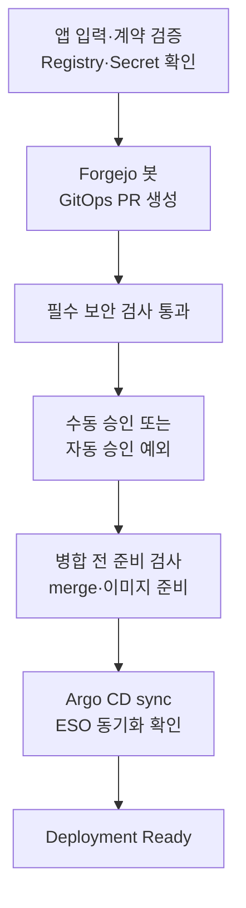
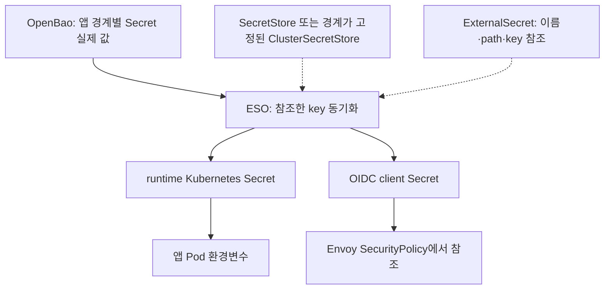

# 템플릿 앱 등록과 Secret 준비

> 대상: Portal에서 앱 하나를 등록하는 신규 사용자와 이를 준비하는 플랫폼 관리자

Portal은 앱 정보를 검증한 뒤 플랫폼 공용 Forgejo 봇으로 GitOps Pull Request를 만듭니다.
사용자는 Forgejo token, Registry credential, OIDC client secret을 입력하지 않습니다.

## 사용자가 입력하는 값

| 구분 | 입력 |
| --- | --- |
| 기본 | 앱 이름, 프로젝트 |
| 프로그램 | HTTPS Git URL·branch·Dockerfile 또는 `<REGISTRY>/<IMAGE>:<FIXED_TAG>` |
| 실행 | container port, replica 수, 자원 preset |
| 접근 | `external` 또는 `internal`, 인증 없음 또는 OIDC, egress 정책 |
| 앱 설정 | 일반 환경변수와, 앱 자체가 필요로 하는 runtime Secret key/value |

`latest`, `main`, `master`, `stable` 같은 가변 image tag는 사용할 수 없습니다. OIDC를
선택하면 Portal이 앱 identity로 client ID, `/oauth2/callback`, 허용 그룹과 ExternalSecret
계약을 계산합니다. OIDC client secret 입력란은 없습니다.

## 플랫폼 관리자가 미리 준비하는 값

- Portal 런타임의 `FORGEJO_BOT_TOKEN` ExternalSecret 동기화
- Zone 또는 AppGroup의 Registry pull ExternalSecret 동기화
- OpenBao workload reader policy와 고정 ESO role
- OIDC 앱의 외부 IdP client, callback, 허용 그룹과 현재 client secret 시드
- Portal이 사용하는 Forgejo 저장소·branch와 Registry push 자격증명

Portal은 Git 기록을 만들기 전에 이 준비 상태를 확인합니다. 준비가 덜 됐으면 외부 API 응답
원문이나 Secret 값을 보여 주지 않고, 관리자가 준비해야 할 항목을 한국어 오류로 반환합니다.

## 배포 흐름

검사와 승인을 통과한 정상 경로입니다. 검사 실패·반려·준비 누락은 해결 전까지 다음 단계로
진행하지 않습니다.

전 사용자 기본값은 수동 승인입니다. 사용자별 자동 승인 예외가 켜져 있어도 보안 검사 반려를
우회하지 않습니다. 보안 문제가 발견되면 사용자는 자신의 소스 저장소에서 취약 package/CVE의
수정 버전을 반영하는 PR을 만들거나 이슈를 등록해 패치한 뒤 다시 신청합니다. private GitOps
감사 저장소 링크는 관리자 대시보드에서만 제공합니다.

이 검사는 앱의 비즈니스 데이터 인가를 자동 증명하지 않습니다. OIDC 그룹은 진입 권한이고,
앱은 요청자별 객체 조회·변경·삭제·내보내기 권한을 서버에서 검사해야 합니다. 앱이 읽은 데이터를
허용된 HTTP 응답으로 내보내는 행위는 egress 차단으로 방지되지 않으므로 민감 데이터 앱은 인가
시험과 코드 검토 증거가 있어야 승인합니다. 기준은 [보안 보장과 한계](security-boundaries.md)입니다.

Secret이 없는 `authentication.mode=none` 앱은 OIDC client나 앱별 ExternalSecret을 만들지
않습니다. runtime Secret이 있는 앱에만 다음 canonical 경계를 사용합니다.

앱 경계의 OpenBao 경로는
`kv/apps/<PROJECT>/<ENVIRONMENT>/workloads/<NAMESPACE>/<ESO_SERVICE_ACCOUNT>`입니다.
실선은 값의 전달, 점선은 ESO가 사용하는 설정 참조입니다.

OIDC client secret도 같은 앱 경계의 OpenBao 문서에 저장되지만 앱 환경변수에는 주입하지
않습니다. Envoy SecurityPolicy가 참조하는 `<APP>-oidc-client` Secret의 `client-secret` key로만
동기화합니다.

## Git에 넣으면 안 되는 것

다음 값은 앱 values, 템플릿, ConfigMap, Docker build arg, 명령행 또는 문서 예시에 넣지 않습니다.

- Forgejo bot token
- Registry username/password 또는 Docker config JSON
- OIDC client secret과 IdP 관리자 자격증명
- 앱 runtime token/password/private key
- root-only credential 파일의 내용이나 host 경로

Git에는 Secret 이름, canonical remote path와 key 이름만 남습니다. Chart나 앱 템플릿이
`kind: Secret`을 직접 생성하는 방식은 지원하지 않습니다.

## 오류별 조치

| Portal 오류 | 조치 |
| --- | --- |
| 공용 Forgejo 봇 준비 안 됨 | 관리자가 Portal auth ExternalSecret의 `FORGEJO_BOT_TOKEN` 동기화를 확인 |
| Registry pull 인증 준비 안 됨 | 관리자가 Zone/AppGroup pull ExternalSecret과 OpenBao registry seed 확인 |
| OIDC 인증 준비 안 됨 | 관리자가 client ID, callback, 허용 그룹과 OpenBao OIDC key를 함께 확인 |
| 앱 Secret 계약 준비 안 됨 | 관리자가 표시된 앱 identity의 canonical path와 ESO role/SA 경계를 확인 |

오류 조사 중에도 `kubectl get secret -o yaml`, Secret 파일 출력, token을 넣은 `curl` 명령을
티켓이나 채팅에 붙이지 않습니다.
