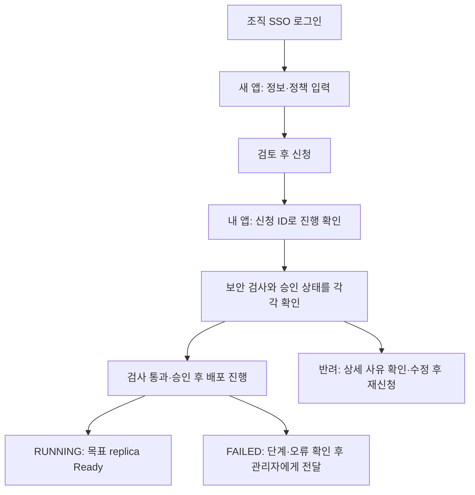

# SADP 사용자 가이드

Portal에서 앱을 신청하고, 배포 상태를 확인하고, 앱을 중지하거나 삭제하는 방법을 안내합니다.
웹 브라우저로 진행하며 서버에 접속하거나 Kubernetes 명령을 실행할 필요는 없습니다.

처음에는 **로그인 → 새 앱 신청 → 내 앱에서 결과 확인** 순서로 진행하세요.
소스 저장소나 Dockerfile을 아직 준비하지 않았다면 [개발자 가이드](developer-guide.md)를 먼저 읽으세요.
용어가 낯설면 [기본 개념](concepts.md)을 참고할 수 있습니다.

## 1. 시작 전에 받을 것

- Portal 주소 `https://<PORTAL_HOST>`
- 조직 SSO 계정: 조직에서 사용하는 로그인 계정
- 조회 권한 `deployments:read`: 신청 목록과 상태를 볼 수 있는 권한
- 쓰기 권한 `deployments:write`: 앱 신청·중지·재개·삭제에 필요한 권한

주소나 권한을 모르면 플랫폼 관리자에게 요청하세요. kubeconfig나 관리자용 토큰은 받지 않아도 됩니다.

브라우저에 인증서 경고가 나타나면 무시하고 로그인하지 말고 관리자에게 알립니다.

## 2. 로그인

1. Portal 주소를 엽니다.
2. 조직 SSO 로그인을 선택합니다.
3. 조직 SSO 화면이 나오면 조직 계정으로 로그인합니다.
4. 다시 Portal로 돌아오는지 확인합니다.

Portal 화면으로 돌아오면 로그인 단계가 끝난 것입니다. 필요한 메뉴가 보이지 않으면 권한을 확인하세요.
로그인 화면이 계속 반복되면 사용자 ID, 발생 시각, 화면의 오류 문구를 관리자에게 전달하세요.
비밀번호, 토큰, 로그인 쿠키는 보내지 않습니다.

## 3. 화면 지도

| 메뉴 | 하는 일 |
| --- | --- |
| 홈 | 내 앱, 최근 신청, 사용할 수 있는 자원 한도(쿼터) 확인 |
| 서비스 | 사용할 수 있는 공개·SSO·관리 서비스 확인 |
| 내 앱 | 신청 이후 진행 단계, 승인·보안 검사 결과, 오류와 실행 상태 확인 |
| 배포 | `.env`의 환경변수를 일반 설정과 비밀값(Secret)으로 분류 |
| 새 앱 | 단일 앱 또는 AppGroup 신청 |

## 4. 단일 앱 신청

승인 대기 중에는 build·merge·배포가 시작되지 않습니다.

새 앱 화면의 다섯 단계를 순서대로 진행합니다. 입력값의 의미는 다음과 같습니다.

1. 앱 이름과 프로젝트를 정합니다.
2. 사용자명·비밀번호·토큰이 포함되지 않은 HTTPS Git 주소, 사용할 branch, Dockerfile 경로를 입력합니다.
3. 앱이 실제로 듣는 포트, 실행할 복제본 수(replica), CPU·메모리 묶음(preset)을 선택합니다.
4. 외부 공개 여부, SSO, 외부 통신 정책을 선택합니다.
5. 예상 URL과 자원을 검토하고 신청합니다.

앱의 외부 공개 여부와 앱이 외부 API에 연결할 수 있는지는 서로 다른 선택입니다.
SSO를 선택하면 앱 접속 때 조직 로그인이 필요합니다. `web` 통신 정책은 내부망을 제외한 인터넷 TCP 80/443을
허용하는 정책이며 특정 도메인만 허용하는 기능은 아닙니다.

신청이 끝나면 신청 ID를 기록하고 **내 앱**에서 진행 상태를 확인합니다.
배포가 진행되는 동안 같은 앱을 반복 신청하지 마세요. 배포 변경안을 보관하는 GitOps 저장소는
관리자와 봇이 사용하는 비공개 저장소입니다. 사용자는 Portal에 표시된 결과를 확인하면 됩니다.

## 5. 환경변수 분류

| 분류 | 넣는 값 | 저장 위치 |
| --- | --- | --- |
| ConfigMap | 로그 수준, 기능 켜기/끄기처럼 공개돼도 되는 설정 | Git에 보관하는 앱 설정(values) |
| OpenBao | 비밀번호, 토큰, API 키 등 민감한 값 | 비밀 저장소 → ESO가 동기화 → 앱의 Kubernetes Secret |

환경변수는 앱이 실행할 때 읽는 설정입니다. 예를 들어 로그 수준은 일반 설정이고,
데이터베이스 비밀번호는 Secret입니다. 민감한지 애매하면 OpenBao를 선택하세요.
OpenBao 값은 제출 전 브라우저 메모리에만 있으므로 새로고침했다면 다시 입력해야 합니다.
Git에는 실제 비밀값 대신 key 이름만 남습니다.

## 6. 여러 앱 함께 배포(AppGroup)

웹 서버와 백그라운드 작업처럼 여러 서비스를 묶어 신청할 때 사용합니다.
Compose 파일은 서비스별 이미지와 실행 구성을 적은 파일입니다.

1. **새 앱**에서 Compose 배포 링크를 엽니다.
2. 플랫폼 전체에서 유일한 그룹 이름을 정합니다.
3. Git URL 또는 Compose 원문을 입력합니다.
4. **앱 구성 확인**을 실행합니다.
5. 서비스별 공개, SSO, 통신, Secret key를 설정합니다.
6. 설정을 바꿨다면 다시 **앱 구성 확인**을 실행합니다.
7. 검증 결과가 맞으면 **배포 신청**을 누릅니다.

AppGroup은 **미리 만든 이미지**만 사용하며, 내용이 바뀌지 않는 tag 또는 digest가 필요합니다.
Compose의 `build:`로 소스부터 이미지를 만드는 방식은 지원하지 않습니다.
Secret은 관리자가 OpenBao에 미리 준비한 key 이름을 선택합니다. Compose 원문에 비밀값을 쓰지 마세요.
같은 그룹 안의 앱도 보내는 쪽과 받는 쪽 모두에서 연결을 허용해야 통신할 수 있습니다.

## 7. 내 앱과 상태

**진행 상태, 승인 상태, 보안 검사 결과를 함께 보세요.** 진행 상태는 신청이 어디까지 처리됐는지,
승인은 관리자가 배포를 허용했는지, 보안 검사는 필수 검사가 통과했는지를 뜻합니다.
`PENDING`만으로는 승인 여부를 알 수 없습니다.

| 파이프라인 상태 | 의미 |
| --- | --- |
| `PENDING` | 변경안 생성, 승인 대기, 이미지 빌드, 배포 또는 상태 변경 중. 상세 화면에서 현재 단계를 확인하세요. |
| `RUNNING` | 배포 완료, 목표 개수의 앱 복제본이 준비됨. 앱 주소에서 기능도 확인하세요. |
| `STOPPED` | 실행 복제본이 0개이고 외부 접속 경로도 제거됨 |
| `FAILED` | 이미지 빌드, 배포 또는 실행 상태 변경 실패. 상세 오류를 확인하세요. |

| 승인 상태 | 의미 |
| --- | --- |
| 승인 대기 | 관리자가 아직 결정하지 않았습니다. 이 상태에서는 build·merge·배포하지 않습니다. |
| 승인 | 수동 승인 또는 사용자별 자동 승인 예외가 감사 기록과 함께 저장됐습니다. |
| 반려 | 관리자 또는 보안 검사가 요청을 반려했습니다. 상세 사유를 확인합니다. |

| 보안 검사 | 의미 |
| --- | --- |
| 검사 중 | 필수 check가 등록되고 끝나기를 기다립니다. check가 없으면 통과로 간주하지 않습니다. |
| 통과 | 필수 보안 check를 통과했습니다. 별도의 승인 전에는 배포하지 않습니다. |
| 반려 | 취약 package/CVE가 발견돼 열린 배포 PR이 닫혔습니다. |

`FAILED` 또는 반려이면 상세 화면의 신청 ID, 파이프라인 단계와 메시지를 확인합니다. 보안 반려에는
취약 package, CVE, 수정 버전이 표시됩니다. **자신이 신청한 소스 저장소**에서 수정 PR을 만들거나
이슈를 등록해 패치한 뒤 다시 신청합니다. private GitOps 감사 저장소 접근은 필요하지 않습니다.

상세 화면의 GitOps/보안 감사 PR 버튼은 비활성화되어 있습니다. 실제 PR 링크와 승인·반려 작업은
`platform-admin` 전용 관리자 대시보드에서만 제공합니다.

## 8. 중지·재개·삭제

- **중지**: 앱 실행을 멈추고 외부 접속 경로를 제거합니다. Secret과 저장공간(PVC)은 유지하며,
  자원 한도도 계속 예약합니다.
- **재개**: 중지 전의 복제본 수와 외부 접속 경로를 복원합니다.
- **삭제**: 앱의 배포 설정을 제거합니다. named volume으로 만든 PVC의 데이터도 삭제됩니다.

잠시 사용하지 않을 때는 중지를 선택하세요. **삭제는 데이터 삭제를 포함하므로** 필요한 데이터가
있다면 삭제 전에 관리자에게 앱 데이터 백업 여부를 확인하세요.

## 9. 자주 묻는 문제

| 증상 | 먼저 할 일 |
| --- | --- |
| Portal에 접속되지 않음 | 정확한 HTTPS 주소와 발생 시각 확인 |
| 로그인 반복 | 새 계정을 만들지 말고 사용자 ID와 오류 전달 |
| 신청 거부 | 빨간 입력 필드와 서버 메시지 확인 |
| 오래 `PENDING` | 파이프라인·승인·보안 검사 상태를 각각 확인 |
| `RUNNING`인데 접속 실패 | 앱 URL, container port, 발생 시각 전달 |
| Secret 저장 실패 | 값은 보내지 말고 앱 이름과 key 이름만 전달 |

## 10. 문제를 전달할 때

관리자에게 앱 이름, 신청 ID, 발생 시각, 오류 문구, Git commit을 전달합니다. password, API token,
private key, session cookie, 전체 `.env`, kubeconfig, OpenBao root token은 보내지 않습니다.

저장소와 Dockerfile을 준비해야 하면 [개발자 가이드](developer-guide.md)를 읽으십시오.
